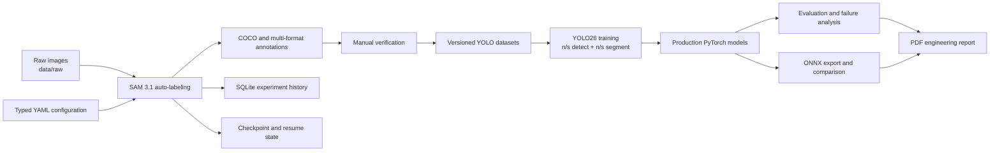

# PPE Auto-Labeling and YOLO26 Training Pipeline

A batch pipeline for generating PPE datasets from raw images using SAM 3.1, human-verified ground truth, training and evaluating 4 YOLO26 models, and exporting ONNX models for downstream deployment.

This repository covers the full workflow from **raw image → auto-label → verified dataset → training → evaluation → ONNX export → engineering report**, with emphasis on reproducibility, checkpoint recovery, explicit configuration, and traceable artifacts.

> **Implementation status:** The core system runs as an offline batch CLI and already has production model artifacts, but it is not a multi-user production service. See [Known limitations and operational risks](#known-limitations-and-operational-risks) before deploying.

## Table of contents

- [System scope](#system-scope)
- [Architecture](#architecture)
- [Key results](#key-results)
- [Supported PPE classes](#supported-ppe-classes)
- [Repository structure](#repository-structure)
- [Prerequisites](#prerequisites)
- [Quick start](#quick-start)
- [Operating workflows](#operating-workflows)
- [Configuration and outputs](#configuration-and-outputs)
- [Testing and quality gates](#testing-and-quality-gates)
- [Known limitations and operational risks](#known-limitations-and-operational-risks)
- [Documentation](#documentation)
- [Engineering governance](#engineering-governance)

## System scope

| Capability | Implementation | Status |
|---|---|---|
| SAM auto-labeling | Text-prompted segmentation for 6 PPE classes | Implemented |
| Annotation output | Bounding boxes, masks, visualization, and 11 export formats | Implemented |
| Recovery | Atomic checkpoint writes and configurable resume policy | Implemented |
| SAM experiment tracking | SQLite run, image, and metric records | Implemented |
| Ground-truth preparation | Manual verification followed by versioned dataset preparation | Implemented; review is external/manual |
| YOLO26 training | Nano/small × detection/segmentation | Implemented |
| Evaluation | Precision, recall, mAP50, mAP50-95, per-class results, and failure artifacts | Implemented |
| Deployment artifacts | Four production `.pt` models and four ONNX exports | Available |
| Root orchestration | Interactive/direct CLI with `sam`, `yolo`, and `pred` modes | Implemented for the configured WSL2 environment |
| REST API, job queue, review UI | No runtime implementation | Not implemented |

## Architecture



### Dependency direction

- `pipeline_cli.py` coordinates repository-level `sam`, `yolo`, and `pred` workflows through subprocesses.
- `sam3_auto_label/src/batch_segment.py` coordinates one SAM batch.
- `config.py` owns YAML parsing, typed dataclass construction, and centralized validation.
- `inference.py` owns device selection, SAM model loading, prompt inference, thresholding, NMS, and mask encoding.
- `exporters.py` owns format-specific annotation serialization.
- `tracker.py` owns SQLite experiment persistence.
- `yolo26_ppe/scripts/pipeline/` owns dataset preparation, training, evaluation, ONNX export, robustness analysis, reporting, and prediction.

Detailed diagrams and design rationale are available in [docs/architecture/system-architecture.md](docs/architecture/system-architecture.md) and [docs/design/component-design.md](docs/design/component-design.md).

## Key results

The following values come from the current canonical evaluation artifact: [`yolo26_ppe/reports/inputs/final_eval_results.json`](yolo26_ppe/reports/inputs/final_eval_results.json). Segmentation models report both box (B) and mask (M) metrics, as required by the Ultralytics segmentation validation contract.

| Model | Task | Precision | Recall | mAP50 | mAP50-95 |
|---|---|---:|---:|---:|---:|
| YOLO26n | Detection (B) | 0.777 | 0.665 | 0.712 | 0.514 |
| **YOLO26s** | **Detection (B)** | **0.862** | **0.758** | **0.808** | **0.644** |
| YOLO26n-seg | Segmentation (B) | 0.720 | 0.522 | 0.547 | 0.365 |
| YOLO26n-seg | Segmentation (M) | 0.659 | 0.466 | 0.491 | 0.277 |
| YOLO26s-seg | Segmentation (B) | 0.824 | 0.606 | 0.654 | 0.485 |
| YOLO26s-seg | Segmentation (M) | 0.758 | 0.524 | 0.555 | 0.340 |

**Current conclusion:** YOLO26s detection has the strongest reported box accuracy. The project target of `mAP50 >= 0.85` was not achieved; dataset size, rare-class coverage, and label consistency remain the primary constraints. For segmentation models, mask (M) metrics are lower than box (B) metrics across all models, which is expected because mask IoU is stricter than box IoU.

SAM 3.1 benchmark evidence is stored in [`sam3_benchmark_results.json`](yolo26_ppe/reports/inputs/sam3_benchmark_results.json): 92 test images, approximately `2755 ms/image`, `0.36 FPS`, and a `3340 MB` model artifact. Historical reports may contain results from earlier runs; use the linked JSON artifacts as the source of truth for the values shown in this README.

## Supported PPE classes

SAM auto-labeling uses 6 prompt classes. YOLO dataset v2 uses 5 classes by merging `sandals` into `shoes`.

| SAM ID | SAM class | Text prompt | Threshold | YOLO v2 class |
|---:|---|---|---:|---|
| 1 | `person` | `person` | 0.70 | `person` |
| 2 | `helmet` | `helmet` | 0.25 | `helmet` |
| 3 | `boots` | `boots` | 0.25 | `boots` |
| 4 | `shoes` | `shoes` | 0.25 | `shoes` |
| 5 | `sandals` | `flip-flops` | 0.30 | merged into `shoes` |
| 6 | `harness` | `safety harness` | 0.25 | `harness` |

Sources: [`ppe_6class.yaml`](sam3_auto_label/config/ppe_6class.yaml) and YOLO v2 [`data.yaml`](yolo26_ppe/data/yolo_detection_dataset_version_2/data.yaml).

## Repository structure

```text
auto_label/
├── pipeline_cli.py                 # Repository-level interactive/direct CLI
├── auto_label.sh                   # WSL2/ROCm wrapper for pipeline_cli.py
├── sam3_auto_label/
│   ├── src/                        # Config, inference, batch, exporters, tracking
│   ├── config/                     # SAM YAML configuration
│   ├── sam3/                       # Vendored SAM source
│   ├── setup.py                    # Hardware-aware SAM environment setup
│   ├── Dockerfile
│   └── docker-compose.yml
├── yolo26_ppe/
│   ├── configs/                    # Training, augmentation, and MLflow config
│   ├── scripts/pipeline/           # Prepare, train, evaluate, export, report, predict
│   ├── data/                       # Versioned detection/segmentation datasets
│   ├── models/production/          # Production PyTorch weights
│   ├── artifacts/onnx_models/      # Production ONNX models
│   └── reports/                    # Metrics, figures, and final PDF report
├── data/
│   ├── raw/                        # Input batches
│   └── sam_outputs_ground_truth/   # SAM annotations and visualizations
├── tests/                          # Root CLI and SAM-focused tests
├── docs/                           # Architecture, pipeline, model, and operations docs
└── AGENTS.md                       # Mandatory engineering and repository rules
```

Generated datasets, model weights, binary databases, and reports can be large. Treat them as controlled artifacts rather than normal source files.

## Prerequisites

### Runtime

- Python `3.10–3.12`; Python `3.12` is the project target.
- Git, used for source control and SAM experiment metadata.
- PyTorch selected for the target hardware: NVIDIA CUDA, AMD ROCm, Apple MPS, or CPU.
- Recommended operational environment: Linux or WSL2 with a supported GPU.
- Sufficient storage for the SAM checkpoint (`~3.34 GB`), Python dependencies, datasets, model weights, and generated outputs.

### Python dependencies

SAM dependencies are pinned in [`sam3_auto_label/requirements.txt`](sam3_auto_label/requirements.txt). PyTorch and torchvision are installed separately because the package index depends on the accelerator.

YOLO dependencies are declared in [`yolo26_ppe/requirements.txt`](yolo26_ppe/requirements.txt).

The root CLI imports `questionary` and `rich`, while the documented quality gates use `pytest`, `ruff`, and `mypy`. These tools are not currently consolidated in a repository-level runtime/development dependency manifest. Provision them explicitly in the working environment until that packaging gap is resolved:

```bash
python -m pip install questionary rich pytest ruff mypy
```

## Quick start

> **Entry point:** `./auto_label.sh` is the recommended way to run the pipeline. It handles environment detection, ROCm setup, and launches the interactive CLI. For a fresh machine, run `./setup.sh` first to create the venv and download the SAM checkpoint.

### One-shot setup + launch (fresh machine)

```bash
./setup.sh                    # setup env + launch pipeline interactively
./setup.sh --check-only       # inspect hardware only, install nothing
./setup.sh --no-launch        # setup only, do not launch
./setup.sh -- --sam --batch blurred  # setup then run SAM on a batch
```

`setup.sh` finds a Python interpreter, runs `sam3_auto_label/setup.py` (creates `sam3_venv`, installs PyTorch, downloads the SAM checkpoint after asking), then launches `auto_label.sh`.

### Run the pipeline

```bash
./auto_label.sh                          # interactive mode (dropdowns)
./auto_label.sh --dry-run --yolo --model small_detection  # preview
./auto_label.sh --sam --batch blurred --resume            # SAM auto-label
./auto_label.sh --yolo --model nano_detection,small_detection --stage 12
./auto_label.sh --pred --batch blurred --model small_detection \
  --conf 0.25 --iou 0.45 --imgsz 640
```

Valid model keys:

- `nano_detection`
- `small_detection`
- `nano_segmentation`
- `small_segmentation`

### Manual SAM batch (advanced)

For direct SAM execution without the wrapper, from `sam3_auto_label/`:

```bash
PYTHONPATH=src:sam3 sam3_venv/bin/python src/batch_segment.py \
  --config config/ppe_6class.yaml \
  --input ../data/raw/<batch> \
  --output ../data/sam_outputs_ground_truth/<batch> \
  --fresh
```

Use `--resume` instead of `--fresh` to continue a checkpointed run.

### Checkpoint path

`setup.py` downloads to `models/sam3/sam3.1_multiplex.pt`; the runtime expects `checkpoints/sam3.1_multiplex.pt`. Create a symlink after setup:

```bash
mkdir -p checkpoints
ln -s ../models/sam3/sam3.1_multiplex.pt checkpoints/sam3.1_multiplex.pt
```

## Operating workflows

### YOLO pipeline stages

The root CLI resolves the repository root and SAM interpreter at runtime, supporting both WSL2 and Windows. `YOLO_PYTHON` and `SAM_PYTHON` environment variables can override the interpreters if needed.

### YOLO pipeline stages

The executable pipeline scripts are ordered in [`yolo26_ppe/scripts/pipeline/`](yolo26_ppe/scripts/pipeline/):

1. `01_prepare_dataset.py`
2. `02_train_models.py`
3. `03_evaluate_models.py`
4. `04_export_and_evaluate_onnx.py`
5. `05_generate_failure_montage.py`
6. `06_run_blur_robustness.py`
7. `07_analyze_blur_robustness.py`
8. `08_generate_report_figures.py`
9. `09_predict_raw_images.py`

Use production weights under `yolo26_ppe/models/production/`. Content under `scripts/archive/` and `models/archive/` exists for reproducibility and should not be modified as part of normal operation.

## Configuration and outputs

### Configuration lifecycle

```text
YAML file → safe parsing → typed dataclasses → centralized validation → CLI overrides → revalidation → application
```

The SAM configuration rejects malformed section types, invalid ranges, duplicate category IDs/names, unsupported devices and formats, quoted booleans, and invalid annotation combinations before model loading.

See [docs/operations/configuration.md](docs/operations/configuration.md) and [`sam3_auto_label/config/README.md`](sam3_auto_label/config/README.md).

### SAM output contract

For each batch under `data/sam_outputs_ground_truth/<batch>/`:

| Path | Purpose |
|---|---|
| `coco/<image>.json` | Durable per-image COCO cache used for resume reconstruction |
| `coco/annotations.json` | Combined COCO export when `coco` is selected |
| `viz/<image>.png` | Visualization overlay when enabled |
| `<format>/` | Selected YOLO, VOC, LabelMe, CVAT, Label Studio, KITTI, CreateML, OpenImages, Supervisely, or mask output |
| `checkpoint.json` | Atomic progress state when checkpointing is enabled |
| `experiments.db` | SQLite experiment, image-result, and metric records |
| `errors.json` | Batch error report when one or more images fail |

An image is committed as successfully processed only after its configured per-image exports complete. A batch containing image/export failures returns a non-zero process exit code.

### Model and report artifacts

| Artifact | Location |
|---|---|
| Production PyTorch weights | `yolo26_ppe/models/production/` |
| Production ONNX models | `yolo26_ppe/artifacts/onnx_models/production/` |
| Evaluation evidence | `yolo26_ppe/artifacts/evaluation/yolo/production_v4_recipe/` |
| Canonical final metrics | `yolo26_ppe/reports/inputs/final_eval_results.json` |
| SAM benchmark | `yolo26_ppe/reports/inputs/sam3_benchmark_results.json` |
| Final report | `yolo26_ppe/reports/final/report.pdf` |

## Testing and quality gates

Run checks from the repository root.

### SAM-focused regression suite

```bash
python -m pytest \
  tests/test_sam_config.py \
  tests/test_sam_inference.py \
  tests/test_sam_batch_segment.py \
  -q
```

These tests avoid loading the real SAM checkpoint or requiring a GPU.

### Root CLI tests

```bash
python -m pytest tests -q
```

This suite requires the root CLI dependencies, including `questionary` and `rich`. Project-wide unrestricted pytest discovery may also collect vendored SAM tests and traverse dataset links; prefer explicit repository-owned test paths in automation.

### Static checks used for the SAM source

```bash
python -m ruff check sam3_auto_label/src tests
python -m mypy \
  sam3_auto_label/src/config.py \
  sam3_auto_label/src/batch_segment.py \
  --ignore-missing-imports
python -m compileall -q sam3_auto_label/src
```

Tests that require large model files, external services, MLflow, datasets, or a GPU should be isolated and documented as integration tests rather than included in the fast unit-test gate.

## Known limitations and operational risks

| Area | Current limitation | Operational impact |
|---|---|---|
| Portability | Root CLI, the default SAM config, and YOLO dataset YAML files contain absolute WSL2 paths | Wrapper and stored datasets are not portable without overrides or controlled configuration changes |
| Packaging | No root manifest consolidates CLI and development tools (`questionary`, `rich`, `pytest`, `ruff`, `mypy`) | Fresh environments cannot run all documented commands from declared dependencies alone |
| Checkpoint deployment | Setup download path differs from runtime checkpoint path | Manual link/copy step is required after setup |
| Hardware versions | ROCm versions differ across setup script, requirements guidance, Docker image, and wrapper | Validate the complete driver/runtime/PyTorch matrix before deployment |
| Human review | Verification is manual and external to the application | No review queue, audit workflow, or reviewer authorization model |
| Resilience | No bounded retry policy or dedicated GPU OOM recovery | Transient failures require operator intervention or a later rerun |
| Service architecture | No REST API, job queue, scheduler, authentication, or multi-user isolation | Suitable for controlled batch operation, not an online service |
| Observability | Local logs and SQLite tracking only | No centralized metrics, tracing, alerting, or log aggregation |
| Visualization | Overlay colors use a hard-coded category-ID palette that is stale for several configured classes | Treat text labels as authoritative and correct the palette before using color as a review signal |
| Model quality | Best reported box mAP50 is `0.808`, below the `0.85` target | Additional representative data and label-quality work are required |
| Licensing | No top-level license file is present | Redistribution and external use rights are not established by this repository |

Do not describe this repository as fully production-ready until environment portability, dependency packaging, checkpoint deployment, failure recovery, model acceptance criteria, monitoring, and licensing are resolved for the target deployment.

## Documentation

Start with the [documentation index](docs/README.md).

| Topic | Document |
|---|---|
| Product overview and requirements | [Overview](docs/00-overview.md) · [Requirements](docs/01-requirements.md) |
| Architecture and data flow | [System architecture](docs/architecture/system-architecture.md) · [Data flow](docs/architecture/data-flow.md) |
| Component behavior | [Component design](docs/design/component-design.md) · [Sequence diagram](docs/design/sequence-diagram.md) · [State diagram](docs/design/state-diagram.md) |
| Auto-labeling and quality | [Pipeline flow](docs/pipeline/pipeline-flow.md) · [Auto-labeling strategy](docs/pipeline/auto-labeling-strategy.md) · [Quality control](docs/pipeline/quality-control.md) |
| Ground truth and YOLO training | [Ground-truth generation](docs/pipeline/ground-truth-generation.md) · [YOLO26 training](docs/pipeline/yolo26-training.md) |
| Models | [SAM 3.1](docs/models/sam3.md) · [YOLO26](docs/models/yolo26.md) · [Classifier status](docs/models/classifier.md) |
| Operations | [Configuration](docs/operations/configuration.md) · [CLI](docs/operations/cli-and-api.md) · [Testing](docs/operations/testing.md) · [Performance](docs/operations/performance.md) · [Error handling](docs/operations/error-handling.md) · [Troubleshooting](docs/operations/troubleshooting.md) |
| Deployment | [Deployment](docs/architecture/deployment.md) |

The detailed docs use Markdown Preview Enhanced features such as PlantUML, KaTeX, `@import`, and executable code chunks. GitHub can display the Markdown text, but rendering all embedded features requires the documented local tooling.

## Engineering governance

Before changing code, configuration, models, datasets, or operational documentation:

1. Read [`AGENTS.md`](AGENTS.md).
2. Inspect `git status` and preserve unrelated work.
3. Verify behavior against current code, configuration, tests, and artifacts.
4. Use authoritative documentation for framework, runtime, hardware, and interoperability decisions.
5. Add behavior-focused tests for every logic change.
6. Run relevant lint, type, syntax, configuration, and test checks.
7. Keep generated artifacts, production data, credentials, and model binaries under explicit lifecycle control.
8. Report exactly which checks were run and which integration risks remain.

This repository contains research, operational, and generated artifacts in addition to source code. Keep commits focused and do not mix code refactors, dataset regeneration, model updates, and documentation changes without a clear review and rollback plan.
