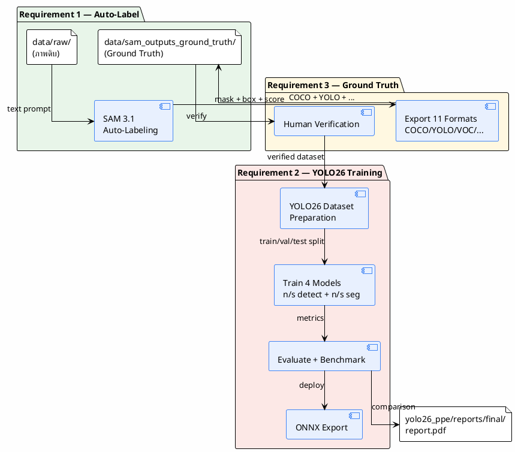
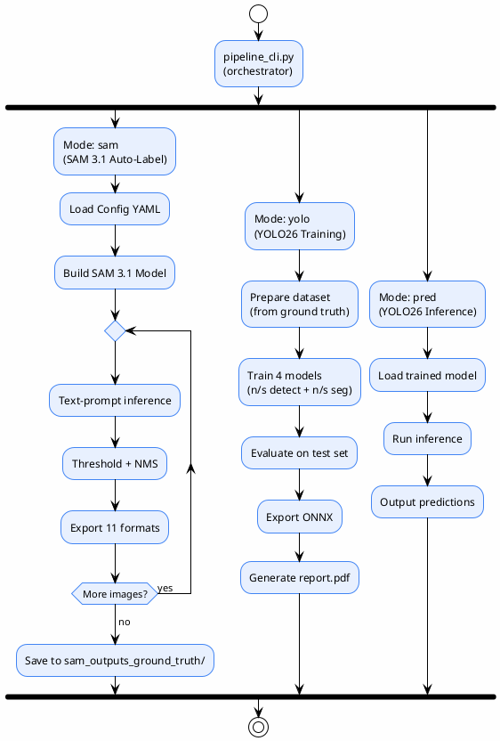

# 00 — Overview

> เอกสารภาพรวมระบบ **PPE Auto-Labeling & YOLO26 Training Pipeline**
>
> ครอบคลุม 3 requirements: (1) SAM 3.1 auto-labeling, (2) YOLO26 training, (3) ground-truth generation
>
> **Status**: Verified — สอบกับโค้ดจริงใน `sam3_auto_label/src/`, `yolo26_ppe/`, `pipeline_cli.py` และรายงาน `yolo26_ppe/reports/final/report.pdf`

---

## 3 Requirements

| # | Requirement | สถานะ | โมดูล |
|---|-------------|-------|-------|
| **RQ1** | ทำ auto-label ภาพ PPE ด้วย SAM 3.1 | ✅ ทำเสร็จ | `sam3_auto_label/` |
| **RQ2** | ทำ YOLO26 train จากชุด PPE (harness, helmet, รองเท้า) | ✅ ทำเสร็จ | `yolo26_ppe/` |
| **RQ3** | ทำ ground truth จาก data ที่ส่งไปให้ | ✅ ทำเสร็จ | `sam3_auto_label/` → `data/sam_outputs_ground_truth/` |

> ผู้ใช้ได้รัน auto-label แล้ว และรายงานฉบับสมบูรณ์อยู่ที่ `yolo26_ppe/reports/final/report.pdf`

---

## Problem

การ label ภาพ PPE ด้วยมนุษย์ช้าและสิ้นเปลือง — ต้องวาด bounding box และ segmentation mask ทีละภาพ ทีละคลาส สำหรับ dataset ขนาดหมื่นภาพไม่มีทางทัน และยังต้องเลือกโมเดลที่เหมาะสมสำหรับ production (แม่นยำ vs เร็ว)

## Goal

1. **สร้าง annotation อัตโนมัติ** ด้วย **SAM 3.1** โดยใช้ text prompt บอกโมเดลว่า "หา person / helmet / boots / ..." แล้วโมเดลคืน mask + bounding box + confidence score พร้อม export เป็น 11 ฟอร์แมต
2. **เทรน YOLO26** 4 รุ่น (n/s detect + n/s seg) จากชุดข้อมูลที่ SAM 3.1 สร้าง เพื่อเปรียบเทียบ accuracy–efficiency trade-off
3. **สร้าง ground truth** ที่ใช้เป็น dataset สำหรับเทรนและประเมินโมเดล

---

## System Overview

---

## Input

- **RQ1/RQ3**: โฟลเดอร์ภาพดิบ (`data/raw/`) รองรับ `.jpg`, `.jpeg`, `.png`, `.bmp`, `.webp`, `.tiff`, `.tif` (case-insensitive)
- **RQ2**: ชุดข้อมูล PPE ที่สร้างจาก RQ1 (913 ภาพ, 5 คลาส — หลัง human verification)

## Output

- **RQ1/RQ3**: โฟลเดอร์ `data/sam_outputs_ground_truth/` ภายใต้โฟลเดอร์ย่อย:
  - `coco/` — COCO JSON (per-image + combined `annotations.json`)
  - `viz/` — ภาพ overlay (mask + box + label + score)
  - `<format>/` — หนึ่งโฟลเดอร์ต่อ export format ที่เลือก
  - `experiments.db` — SQLite experiment log
  - `checkpoint.json` — checkpoint สำหรับ resume
- **RQ2**: โมเดล YOLO26 ที่เทรนแล้ว 4 ตัว + ONNX exports + รายงานเปรียบเทียบ (`report.pdf`)

---

## Supported Classes (6 คลาส PPE)

| ID | Name | Text Prompt | Per-class Threshold | ใช้ใน YOLO26 |
|----|------|-------------|---------------------|--------------|
| 1 | `person` | `person` | 0.7 | ✅ |
| 2 | `helmet` | `helmet` | 0.25 | ✅ |
| 3 | `boots` | `boots` | 0.25 | ✅ |
| 4 | `shoes` | `shoes` | 0.25 | ✅ |
| 5 | `sandals` | `flip-flops` | 0.3 | ✅ |
| 6 | `harness` | `safety harness` | 0.25 | ✅ |

> ที่มา: `sam3_auto_label/config/ppe_6class.yaml`
>
> **หมายเหตุ**: YOLO26 เทรนบน 5 คลาส (person, helmet, boots, shoes, harness) — sandals มีเพียง 4 ภาพในชุดเดิม จึงถูก oversampling แต่ mAP50 = 0

---

## Pipeline Overview (3 Modes)

> `pipeline_cli.py` มี 3 modes: `sam`, `yolo`, `pred` — สามารถเรียกแบบ interactive หรือ CLI โดยตรง

---

## YOLO26 Training Results (RQ2)

> ที่มา: `yolo26_ppe/reports/inputs/final_eval_results.json` และ `yolo26_ppe/reports/metrics/comparison_report.md`

| Model | Task | mAP50 | mAP50-95 | Precision | Recall | Inference (ms) | Size (MB) |
|-------|------|-------|----------|-----------|--------|----------------|-----------|
| YOLO26n | detect | 0.712 | 0.514 | 0.777 | 0.665 | 33.0 | 10.0 |
| YOLO26s | detect | **0.808** | **0.644** | **0.862** | **0.758** | 31.3 | 38.3 |
| YOLO26n-seg | segment | 0.547 | 0.365 | 0.720 | 0.522 | 33.8 | 11.3 |
| YOLO26s-seg | segment | 0.654 | 0.485 | 0.824 | 0.606 | 30.8 | 42.0 |
| SAM 3.1 | segment | N/A | N/A | N/A | N/A | 700.0 | 3300.0 |

### ข้อสรุป

- **Best overall**: YOLO26s detect (mAP50=0.808) — แม่นที่สุด เร็ว 100x ของ SAM 3.1
- **Best edge**: YOLO26n detect — เล็กที่สุด (10 MB) เหมาะ edge deployment
- **Best zero-shot**: SAM 3.1 — ไม่ต้องเทรน ใช้ text prompt ได้ทุกคลาส
- **Target mAP50 ≥ 0.85**: ไม่ผ่าน — สาเหตุหลักคือ dataset size + class imbalance (sandals 4 ภาพ, harness 102 ภาพ)

---

## Technology Stack

| Layer | Technology | Version | ใช้ใน |
|-------|-----------|---------|-------|
| Segmentation Model | SAM 3.1 (multiplex checkpoint) | `sam3.1_multiplex.pt` | RQ1, RQ3 |
| Detection/Seg Model | YOLO26 (Ultralytics) | n/s detect + n/s seg | RQ2 |
| Deep Learning Framework | PyTorch | 2.5.1 | RQ1, RQ2 |
| Experiment Tracking (YOLO) | MLflow | — | RQ2 |
| Experiment Tracking (SAM) | SQLite (stdlib) | — | RQ1 |
| Image Processing | OpenCV (headless), Pillow | 4.10.0, 12.3.0 | RQ1 |
| COCO Tools | pycocotools | 2.0.11 | RQ1 |
| Config | PyYAML | 6.0.3 | RQ1, RQ2 |
| Report | XeLaTeX + TH Sarabun New | — | RQ2 |
| Hardware | AMD RX 7800 XT (ROCm, WSL2) | — | RQ1, RQ2 |

> ที่มา: `requirements.txt`, `setup.py`, `yolo26_ppe/configs/`

---

## ขอบเขตที่ระบบทำ

- ✅ **RQ1**: Batch segmentation อัตโนมัติด้วย SAM 3.1 text prompt
- ✅ **RQ1**: 6 คลาส PPE พร้อม per-class threshold
- ✅ **RQ1**: 11 export formats (COCO, YOLO, VOC, LabelMe, CVAT, Label Studio, KITTI, CreateML, OpenImages, Supervisely, masks)
- ✅ **RQ1**: Checkpoint/resume + experiment tracking (SQLite)
- ✅ **RQ2**: เทรน YOLO26 4 รุ่น (300 epochs, SGD, imgsz=640)
- ✅ **RQ2**: MLflow experiment tracking สำหรับ YOLO26
- ✅ **RQ2**: Hyperparameter tuning (3 trials × 4 models)
- ✅ **RQ2**: ONNX export + inference benchmark
- ✅ **RQ2**: รายงานเปรียบเทียบฉบับสมบูรณ์ (`report.pdf`)
- ✅ **RQ3**: สร้าง ground truth จาก SAM 3.1 output
- ✅ **RQ3**: Dataset versioning (v1, v2) ใน `yolo26_ppe/data/`

## ขอบเขตที่ระบบไม่ทำ

- ❌ **Human review queue อัตโนมัติ** — มี human verification แต่ทำแบบ manual ไม่ใช่ระบบ queue
- ❌ **REST API** — `RELEASE_NOTES` ระบุว่ามี FastAPI แต่ **โค้ด src/ ไม่มี**
- ❌ **Multi-model agreement อัตโนมัติ** — เปรียบเทียบในรายงาน แต่ไม่มีระบบ ensemble ใน pipeline
- ❌ **Retry logic** — ภาพที่ inference ล้มเหลวจะถูกข้าม ไม่ retry
- ❌ **GPU OOM handling** — ไม่มี catch `torch.cuda.OutOfMemoryError`
- ❌ **mAP50 ≥ 0.85 target** — ไม่บรรลุเป้าหมายเพราะ dataset จำกัด

---

## อ้างอิง

- `sam3_auto_label/README.md:1-5` — ชื่อและจุดประสงค์
- `sam3_auto_label/src/inference.py:347-365` — SAM 3.1 model build
- `sam3_auto_label/config/ppe_6class.yaml` — 6 คลาสและ threshold
- `pipeline_cli.py:263-265` — 3 modes (sam, yolo, pred)
- `yolo26_ppe/reports/final/report.pdf` — รายงานฉบับสมบูรณ์
- `yolo26_ppe/reports/inputs/final_eval_results.json` — metrics 4 โมเดล
- `yolo26_ppe/reports/metrics/comparison_report.md` — สรุปเปรียบเทียบ
- `yolo26_ppe/reports/source/report.tex:260-309` — บทนำ + 3 objectives
