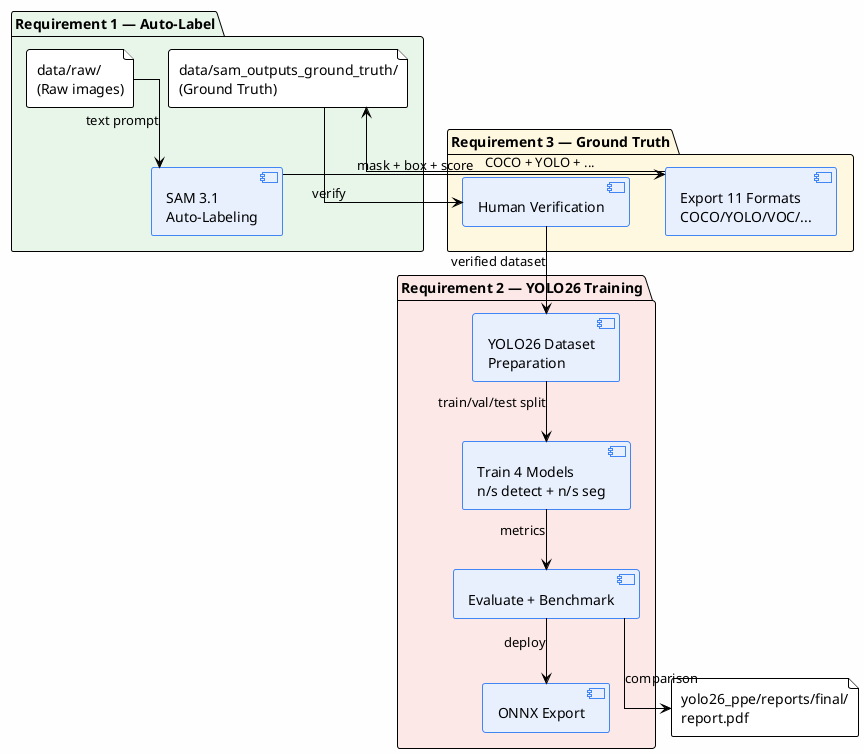
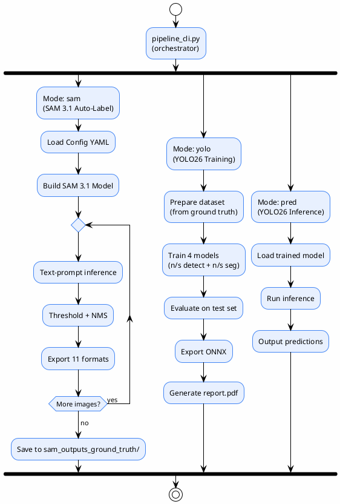

# 00 — Overview

> Overview of the **PPE Auto-Labeling & YOLO26 Training Pipeline** system
>
> Covers 3 requirements: (1) SAM 3.1 auto-labeling, (2) YOLO26 training, (3) ground-truth generation
>
> **Status**: Verified — verified against actual code in `sam3_auto_label/src/`, `yolo26_ppe/`, `pipeline_cli.py` and the report `yolo26_ppe/reports/final/report.pdf`

---

## 3 Requirements

| # | Requirement | Status | Module |
|---|-------------|-------|-------|
| **RQ1** | Auto-label PPE images with SAM 3.1 | ✅ Completed | `sam3_auto_label/` |
| **RQ2** | Train YOLO26 on the PPE dataset (harness, helmet, shoes) | ✅ Completed | `yolo26_ppe/` |
| **RQ3** | Generate ground truth from provided data | ✅ Completed | `sam3_auto_label/` → `data/sam_outputs_ground_truth/` |

> The user has run auto-labeling and the full report is at `yolo26_ppe/reports/final/report.pdf`

---

## Problem

Labeling PPE images manually is slow and costly — drawing bounding boxes and segmentation masks one image and one class at a time is infeasible for a dataset of tens of thousands of images. Additionally, the appropriate model must be selected for production (accuracy vs. speed).

## Goal

1. **Generate annotations automatically** using **SAM 3.1** with text prompts telling the model to "find person / helmet / boots / ..." — the model returns mask + bounding box + confidence score, with export to 11 formats
2. **Train YOLO26** in 4 variants (n/s detect + n/s seg) on the dataset generated by SAM 3.1 to compare the accuracy–efficiency trade-off
3. **Generate ground truth** to serve as the dataset for training and evaluating models

---

## System Overview

---

## Input

- **RQ1/RQ3**: Raw image folder (`data/raw/`) supporting `.jpg`, `.jpeg`, `.png`, `.bmp`, `.webp`, `.tiff`, `.tif` (case-insensitive)
- **RQ2**: PPE dataset generated from RQ1 (913 images, 5 classes — after human verification)

## Output

- **RQ1/RQ3**: The `data/sam_outputs_ground_truth/` folder with subfolders:
  - `coco/` — COCO JSON (per-image + combined `annotations.json`)
  - `viz/` — Overlay images (mask + box + label + score)
  - `<format>/` — One folder per selected export format
  - `experiments.db` — SQLite experiment log
  - `checkpoint.json` — Checkpoint for resume
- **RQ2**: 4 trained YOLO26 models + ONNX exports + comparison report (`report.pdf`)

---

## Supported Classes (6 PPE Classes)

| ID | Name | Text Prompt | Per-class Threshold | Used in YOLO26 |
|----|------|-------------|---------------------|--------------|
| 1 | `person` | `person` | 0.7 | ✅ |
| 2 | `helmet` | `helmet` | 0.25 | ✅ |
| 3 | `boots` | `boots` | 0.25 | ✅ |
| 4 | `shoes` | `shoes` | 0.25 | ✅ |
| 5 | `sandals` | `flip-flops` | 0.3 | ✅ |
| 6 | `harness` | `safety harness` | 0.25 | ✅ |

> Source: `sam3_auto_label/config/ppe_6class.yaml`
>
> **Note**: YOLO26 is trained on 5 classes (person, helmet, boots, shoes, harness) — sandals had only 4 images in the original set, so it was oversampled but still achieved mAP50 = 0

---

## Pipeline Overview (3 Modes)

> `pipeline_cli.py` has 3 modes: `sam`, `yolo`, `pred` — can be invoked interactively or directly via CLI

---

## YOLO26 Training Results (RQ2)

> Source: `yolo26_ppe/reports/inputs/final_eval_results.json` and `yolo26_ppe/reports/metrics/comparison_report.md`

| Model | Task | mAP50 | mAP50-95 | Precision | Recall | Inference (ms) | Size (MB) |
|-------|------|-------|----------|-----------|--------|----------------|-----------|
| YOLO26n | detect | 0.712 | 0.514 | 0.777 | 0.665 | 33.0 | 10.0 |
| YOLO26s | detect | **0.808** | **0.644** | **0.862** | **0.758** | 31.3 | 38.3 |
| YOLO26n-seg | segment | 0.547 | 0.365 | 0.720 | 0.522 | 33.8 | 11.3 |
| YOLO26s-seg | segment | 0.654 | 0.485 | 0.824 | 0.606 | 30.8 | 42.0 |
| SAM 3.1 | segment | N/A | N/A | N/A | N/A | 700.0 | 3300.0 |

### Conclusions

- **Best overall**: YOLO26s detect (mAP50=0.808) — most accurate, 100x faster than SAM 3.1
- **Best edge**: YOLO26n detect — smallest (10 MB), suitable for edge deployment
- **Best zero-shot**: SAM 3.1 — no training required, supports all classes via text prompt
- **Target mAP50 ≥ 0.85**: Not achieved — main reasons are dataset size + class imbalance (sandals 4 images, harness 102 images)

---

## Technology Stack

| Layer | Technology | Version | Used in |
|-------|-----------|---------|-------|
| Segmentation Model | SAM 3.1 (multiplex checkpoint) | `sam3.1_multiplex.pt` | RQ1, RQ3 |
| Detection/Seg Model | YOLO26 (Ultralytics) | n/s detect + n/s seg | RQ2 |
| Deep Learning Framework | PyTorch | 2.5.1 | RQ1, RQ2 |
| Experiment Tracking (YOLO) | MLflow | — | RQ2 |
| Experiment Tracking (SAM) | SQLite (stdlib) | — | RQ1 |
| Image Processing | OpenCV (headless), Pillow | 4.10.0, 12.3.0 | RQ1 |
| COCO Tools | pycocotools | 2.0.11 | RQ1 |
| Config | PyYAML | 6.0.3 | RQ1, RQ2 |
| Report | XeLaTeX + TH Sarabun New | — | RQ2 |
| Hardware | AMD RX 7800 XT (ROCm, WSL2) | — | RQ1, RQ2 |

> Source: `requirements.txt`, `setup.py`, `yolo26_ppe/configs/`

---

## In Scope

- ✅ **RQ1**: Automatic batch segmentation with SAM 3.1 text prompt
- ✅ **RQ1**: 6 PPE classes with per-class threshold
- ✅ **RQ1**: 11 export formats (COCO, YOLO, VOC, LabelMe, CVAT, Label Studio, KITTI, CreateML, OpenImages, Supervisely, masks)
- ✅ **RQ1**: Checkpoint/resume + experiment tracking (SQLite)
- ✅ **RQ2**: Train 4 YOLO26 variants (300 epochs, SGD, imgsz=640)
- ✅ **RQ2**: MLflow experiment tracking for YOLO26
- ✅ **RQ2**: Hyperparameter tuning (3 trials × 4 models)
- ✅ **RQ2**: ONNX export + inference benchmark
- ✅ **RQ2**: Full comparison report (`report.pdf`)
- ✅ **RQ3**: Generate ground truth from SAM 3.1 output
- ✅ **RQ3**: Dataset versioning (v1, v2) in `yolo26_ppe/data/`

## Out of Scope

- ❌ **Automated human review queue** — human verification exists but is done manually, not as a queue system
- ❌ **REST API** — `RELEASE_NOTES` mentions FastAPI but **the src/ code does not contain it**
- ❌ **Automated multi-model agreement** — compared in the report, but no ensemble system in the pipeline
- ❌ **Retry logic** — images that fail inference are skipped, not retried
- ❌ **GPU OOM handling** — no catch for `torch.cuda.OutOfMemoryError`
- ❌ **mAP50 ≥ 0.85 target** — target not achieved due to limited dataset

---

## References

- `sam3_auto_label/README.md:1-5` — Name and purpose
- `sam3_auto_label/src/inference.py:347-365` — SAM 3.1 model build
- `sam3_auto_label/config/ppe_6class.yaml` — 6 classes and thresholds
- `pipeline_cli.py:263-265` — 3 modes (sam, yolo, pred)
- `yolo26_ppe/reports/final/report.pdf` — Full report
- `yolo26_ppe/reports/inputs/final_eval_results.json` — Metrics for 4 models
- `yolo26_ppe/reports/metrics/comparison_report.md` — Comparison summary
- `yolo26_ppe/reports/source/report.tex:260-309` — Introduction + 3 objectives
