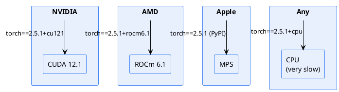

# 01 — Requirements

> System requirements — hardware, software, dependencies
>
> **Status**: Verified — verified against `setup.py`, `requirements.txt`, `Dockerfile`

---

## Hardware Requirements

| Component | Minimum | Recommended |
|-----------|---------|-------------|
| GPU | Optional (CPU supported) | NVIDIA 8GB+ VRAM or AMD ROCm 16GB+ |
| RAM | 8 GB | 16 GB+ |
| Disk | 5 GB (model 3.34 GB + deps) | 10 GB+ (including output) |
| OS | Linux, Windows (WSL2), macOS | Linux/WSL2 (ROCm) |

### Supported GPUs

> Source: `setup.py:95-178`, `Dockerfile:1-77`

---

## Software Requirements

| Software | Version | Source |
|----------|---------|-------|
| Python | 3.12 | `Dockerfile`, `setup.py` |
| PyTorch | 2.5.1 | `setup.py` (installed separately per GPU) |
| torchvision | 0.20.1 | `setup.py` |
| Git | any | `tracker.py` calls `git rev-parse` |

---

## Python Dependencies

### `requirements.txt` (non-torch)

@import "../sam3_auto_label/requirements.txt" {title="requirements.txt"}

> PyTorch is installed separately from `requirements.txt` because the index URL must be selected based on the GPU

### Vendored SAM 3.1

- The `sam3/` folder is the SAM 3.1 source code vendored into the repo
- **Do not modify** (`README.md:73`)
- Imported as `sam3.model_builder`, `sam3.model.sam3_image_processor`, `sam3.eval.postprocessors`, `sam3.perflib.*`

### Parent repo CLI (`pipeline_cli.py`)

| Package | Purpose |
|---------|---------|
| `questionary` | interactive prompts |
| `rich` | terminal formatting |

> Not included in `sam3_auto_label/requirements.txt` — installed in the repo-root-level venv

---

## Model Checkpoint

| Item | Value |
|--------|-----|
| Checkpoint | `sam3.1_multiplex.pt` |
| Size | $3340 \text{ MB} \approx 3.34 \text{ GB}$ |
| URL | `https://huggingface.co/facebook/sam3.1/resolve/main/sam3.1_multiplex.pt` |
| Storage location (runtime) | `sam3_auto_label/checkpoints/sam3.1_multiplex.pt` |

> **⚠️ Known issue**: `setup.py:35` downloads to `models/sam3/` but `config.py:112-113` looks in `checkpoints/` — the file must be moved or symlinked manually after setup

---

## Functional Requirements

### RQ1 — SAM 3.1 Auto-Labeling

| ID | Requirement | Status |
|----|---------|-------|
| FR-01 | Run batch segmentation on an image folder | ✅ |
| FR-02 | Support multi-class text prompts | ✅ (6 classes) |
| FR-03 | Generate bounding box + segmentation mask | ✅ |
| FR-04 | Export to 11 formats | ✅ |
| FR-05 | Checkpoint/resume | ✅ |
| FR-06 | Experiment tracking | ✅ (SQLite) |
| FR-07 | Visualization overlay | ✅ |
| FR-08 | GPU auto-detect | ✅ |

### RQ2 — YOLO26 Training

| ID | Requirement | Status |
|----|---------|-------|
| FR-10 | Train 4 YOLO26 variants (n/s detect + n/s seg) | ✅ (300 epochs) |
| FR-11 | Dataset preparation from ground truth | ✅ (v1, v2) |
| FR-12 | MLflow experiment tracking | ✅ |
| FR-13 | Hyperparameter tuning | ✅ (3 trials × 4 models) |
| FR-14 | ONNX export | ✅ |
| FR-15 | Comparison report (PDF) | ✅ (`report.pdf`) |
| FR-16 | Class balancing (oversampling) | ✅ (sandals, harness) |

### RQ3 — Ground Truth Generation

| ID | Requirement | Status |
|----|---------|-------|
| FR-20 | Generate ground truth from SAM 3.1 output | ✅ |
| FR-21 | Human verification | ✅ (manual) |
| FR-22 | Dataset versioning | ✅ (v1, v2 in `yolo26_ppe/data/`) |
| FR-23 | Train/val/test split | ✅ (335/95/50) |

### Not Implemented

| ID | Requirement | Status |
|----|---------|-------|
| FR-30 | REST API | ❌ Not in code |
| FR-31 | Automated human review queue | ❌ Done manually |
| FR-32 | Multi-model agreement (ensemble) | ❌ Compared in report only |
| FR-33 | mAP50 ≥ 0.85 target | ❌ Not achieved (limited dataset) |

## Non-functional Requirements

### RQ1 — SAM 3.1

| ID | Requirement | Status |
|----|---------|-------|
| NFR-01 | throughput $\geq 0.3$ FPS on GPU | ✅ (~0.36 FPS on test set) |
| NFR-02 | Runs on CPU (slow) | ✅ |
| NFR-03 | No data loss on power failure | ✅ (checkpoint) |
| NFR-04 | reproducible config | ✅ (config_hash) |
| NFR-05 | retry failed images | ❌ Not implemented |
| NFR-06 | GPU OOM recovery | ❌ Not implemented |

### RQ2 — YOLO26

| ID | Requirement | Status |
|----|---------|-------|
| NFR-10 | Training reproducible (seed=42) | ✅ |
| NFR-11 | Inference $\leq 35$ ms for all models | ✅ (30.8–33.8 ms) |
| NFR-12 | Model size $\leq 50$ MB | ✅ (10–42 MB) |
| NFR-13 | ONNX export for deployment | ✅ |
| NFR-14 | mAP50 ≥ 0.85 | ❌ Max 0.808 (s_detect) |

---

## YOLO26 Training Hardware

| Component | Value Used |
|-----------|---------|
| GPU | AMD RX 7800 XT (ROCm, WSL2) |
| Framework | Ultralytics YOLO26 + PyTorch 2.5.1+rocm6.1 |
| Epochs | 300 (detect), 150+50 (seg — 2 stage) |
| Batch size | 8 (detect), 4 (seg) |
| Image size | 640 px |
| Optimizer | SGD (lr0=0.01, lrf=0.01 cosine) |
| Freeze | 10 (backbone frozen) |

> Source: `yolo26_ppe/reports/source/report.tex:652-677`

---

## References

- `sam3_auto_label/requirements.txt:1-23`
- `sam3_auto_label/setup.py:1-405`
- `sam3_auto_label/Dockerfile:1-77`
- `yolo26_ppe/reports/inputs/sam3_benchmark_results.json` — SAM 3.1 benchmark
- `yolo26_ppe/reports/inputs/final_eval_results.json` — YOLO26 metrics
- `yolo26_ppe/reports/source/report.tex:652-677` — training config
- `yolo26_ppe/configs/production_train.yaml` — training config file
