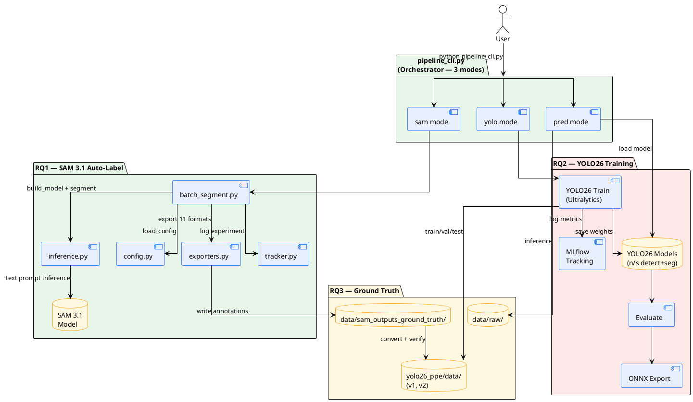
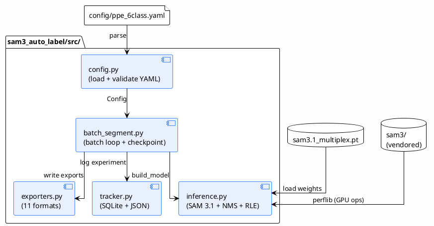
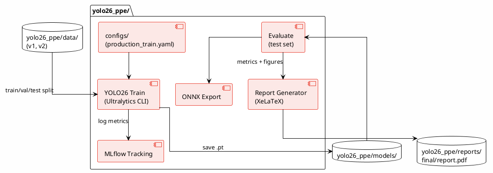
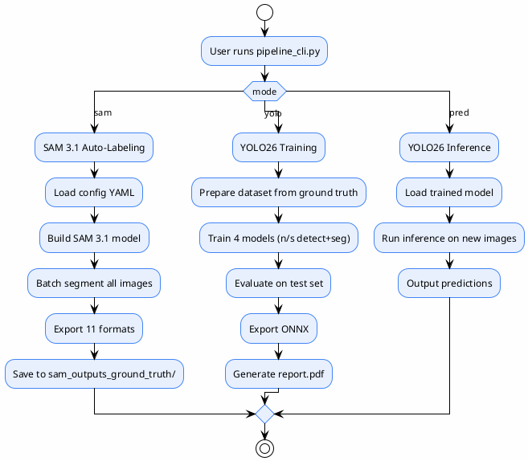

# System Architecture

> Architecture overview — covers 3 requirements (SAM auto-label, YOLO26 train, ground truth)
>
> **Status**: Verified — cross-checked against `sam3_auto_label/src/`, `yolo26_ppe/`, `pipeline_cli.py`

---

## High-Level Architecture



---

## SAM 3.1 Module Architecture (RQ1)



---

## YOLO26 Module Architecture (RQ2)



---

## pipeline_cli.py — 3 Modes

> Source: `pipeline_cli.py:263-265, 550-552, 834-852`



---

## Hardware Utilization (SAM 3.1 Pipeline)

```plantuml {align="center"}
@startuml
!theme plain
skinparam linetype ortho
skinparam backgroundColor #FEFEFE

concise "GPU Thread" as GPU
concise "Prefetch Thread" as PRE
concise "Export Thread" as EXP

@0
GPU is "Segment img N"
PRE is "Load img N+1"
EXP is {idle}

@100
GPU is "Segment img N+1"
PRE is "Load img N+2"
EXP is "Export img N"

@200
GPU is "Segment img N+2"
PRE is "Load img N+3"
EXP is "Export img N+1"

@300
GPU is {idle}
PRE is {idle}
EXP is "Export img N+2"
@enduml
```

> Source: `src/batch_segment.py:270, 287-295, 304, 316-320`
>
> **Note**: This is a CPU thread (ThreadPoolExecutor), not multi-GPU — inference still runs on a single GPU

---

## References

- `pipeline_cli.py:263-265` — 3 modes
- `pipeline_cli.py:550-552` — mode names
- `pipeline_cli.py:834-852` — mode selection
- `sam3_auto_label/src/config.py:70-125` — `Config` dataclass
- `sam3_auto_label/src/inference.py:347-365` — `build_model()`
- `sam3_auto_label/src/batch_segment.py:130-435` — `main()` loop
- `sam3_auto_label/src/exporters.py:577-589` — `EXPORTERS` registry
- `sam3_auto_label/src/tracker.py:23-229` — `ExperimentTracker`
- `yolo26_ppe/configs/production_train.yaml` — YOLO26 training config
- `yolo26_ppe/reports/final/report.pdf` — final report
