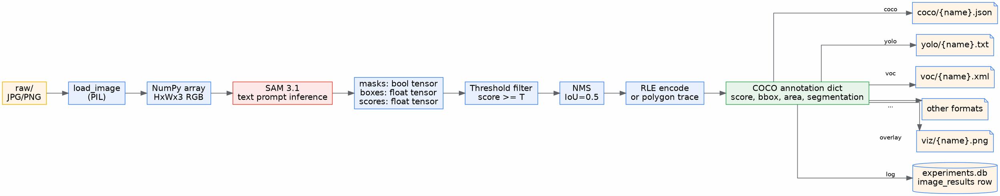
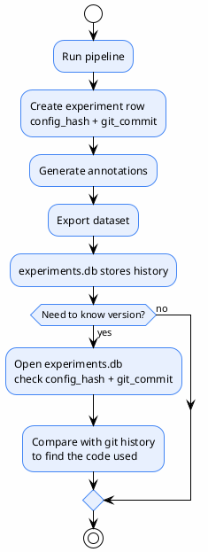

# 04 — Data Flow

> Where data originates → what transformations are applied → where it ends up
>
> **Status**: Verified — cross-checked against `src/config.py:95-109` (path properties) and `src/batch_segment.py`

---

## Input/Output Folder Structure

```
data/
├── raw/                              ← INPUT: raw images
│   ├── IMG_001.jpg
│   ├── IMG_002.png
│   └── ...
│
└── sam_outputs_ground_truth/         ← OUTPUT: all results
    ├── coco/
    │   ├── IMG_001.json              ← per-image COCO (cache for resume)
    │   ├── IMG_002.json
    │   └── annotations.json          ← combined COCO dataset (final)
    │
    ├── viz/
    │   ├── IMG_001.png               ← overlay visualization
    │   └── IMG_002.png
    │
    ├── yolo/                         ← (if format: yolo selected)
    │   ├── IMG_001.txt
    │   ├── data.yaml
    │   └── classes.txt
    │
    ├── voc/                          ← (if format: voc selected)
    │   └── IMG_001.xml
    │
    ├── labelme/                      ← (if format: labelme selected)
    │   └── IMG_001.json
    │
    ├── masks/                        ← (if format: masks selected)
    │   ├── IMG_001_ann1_cat1.png
    │   └── IMG_001_ann2_cat2.png
    │
    ├── experiments.db                ← SQLite experiment log
    ├── checkpoint.json               ← progress checkpoint (deleted on completion if clear_on_success)
    └── errors.json                   ← (if any images errored) summary of errors
```

> Source: `src/config.py:95-109` — `coco_path`, `viz_path`, `masks_path`, `combined_json_path`

---

## Data Flow Diagram



---

## Provenance Metadata

### Per Experiment Run

| Field | Source | Example |
|-------|--------|---------|
| `id` | `run_{timestamp}_{config_hash}_{suffix}` | `run_20260901_143022_a1b2c3d4e5f6_x7y9` |
| `started_at` | ISO timestamp | `2026-09-01T14:30:22.123456` |
| `ended_at` | ISO timestamp | `2026-09-01T15:05:11.789012` |
| `status` | `running` / `completed` / `failed` | `completed` |
| `config_hash` | MD5 hash of threshold+resolution+device+categories | `a1b2c3d4e5f6` |
| `config_json` | JSON of the config used | `{"threshold": 0.25, ...}` |
| `num_images` | Total number of images | `1500` |
| `num_annotations` | Total number of annotations | `12340` |
| `total_time` | Total seconds | `2100.5` |
| `avg_time_per_image` | Average seconds per image | `1.4` |
| `errors` | Number of errored images | `3` |
| `git_commit` | `git rev-parse --short HEAD` | `9d956c1` |

> `src/tracker.py:33-52` (schema), `src/tracker.py:98-124` (start_run)

### Per Image

| Field | Source | Example |
|-------|--------|---------|
| `experiment_id` | FK → experiments | `run_20260901_...` |
| `image_name` | File name | `IMG_001.jpg` |
| `num_annotations` | Number of detections in the image | `8` |
| `time_seconds` | Inference time for this image | `1.35` |

> `src/tracker.py:62-69` (schema), `src/tracker.py:126-141` (log_image_result)

### Per Annotation (in COCO JSON)

@import "../../sam3_auto_label/src/inference.py" {line_begin=491 line_end=520 title="inference.py:491-520 — annotation dict construction"}

---

## What Typical Systems Usually Have (but this code does not)

| Common provenance field | Status | Impact |
|-------------------------|-------|--------|
| `model_version` | ❌ No direct field — only `config_hash` which hashes the entire config | Cannot determine which checkpoint version was used |
| `prompt_version` | ❌ Not present — prompt is in `config_json` but has no version | Changing the prompt makes it impossible to know which prompt old labels used |
| `pipeline_version` | ❌ Not present — `git_commit` serves as proxy | Usable if the commit is not dirty |
| `annotation_source` (`auto`/`reviewed`) | ❌ Not present | All annotations are `auto` by default; no way to distinguish |
| `review_status` | ❌ Not present | No review process |

> **Risk**: If the model checkpoint or prompt is changed and the pipeline is re-run, `experiments.db` cannot indicate which model/prompt was used for old annotations (unless `config_json` is inspected manually)

---

## References

- `src/config.py:95-109` — path properties
- `src/tracker.py:33-71` — SQLite schema
- `src/inference.py:491-520` — annotation dict
- `src/batch_segment.py:155-156` — output dir creation

---


# 11 — Dataset Versioning

> Tracking the version of generated datasets
>
> **Status**: Verified — cross-checked against `src/tracker.py`
>
> **⚠️ Important**: The current system **has no formal dataset versioning** — only `config_hash` and `git_commit` serve as proxies

---

## What Actually Exists

### Config Hash

@import "../../sam3_auto_label/src/tracker.py" {line_begin=73 line_end=83 title="tracker.py:73-83 — _config_hash"}

| Item | Value |
|--------|-----|
| Algorithm | MD5 (first 12 characters) |
| Hash includes | threshold, resolution, device, categories (id+name+prompt) |
| Does not include | checkpoint version, prompt version, pipeline version, output formats |

### Git Commit

@import "../../sam3_auto_label/src/tracker.py" {line_begin=85 line_end=96 title="tracker.py:85-96 — _git_commit"}

| Item | Value |
|--------|-----|
| Mechanism | `git rev-parse --short HEAD` |
| Timeout | 5 seconds |
| Fallback | `"unknown"` on failure |

### Experiments DB Schema



### Current version Tracking Method (manual)

1. Check `experiments.db` → find the run of interest
2. Read `config_hash` and `git_commit`
3. `git show <commit>` to view the code used at that time
4. Read `config_json` to view the threshold/prompt used

> **Inconvenient** — must be done manually each time; no CLI for querying

---

## Versioning Risks

| Risk | Level | Note |
|-----------|-------|---------|
| Changed checkpoint without knowing | High | `config_hash` does not hash checkpoint content |
| Changed prompt causes label changes | High | Prompt is in `config_json` but has no version tag |
| Git commit dirty | Medium | `git_commit` will be HEAD but actual code may have uncommitted changes |
| Deleting `experiments.db` | High | Everything is lost — no backup mechanism |

---

## YOLO26 Data Flow (RQ2)

```dot {align="center"}
digraph YOLODataFlow {
  bgcolor="#FEFEFE";
  splines=ortho;
  rankdir=LR;
  node [shape=box, style="rounded,filled", fillcolor="#E8F0FE", fontname="Helvetica"];
  edge [color="#4285F4", fontname="Helvetica", fontsize=10];

  SAM_GT [label="SAM 3.1 Output\n(data/sam_outputs_ground_truth/)", fillcolor="#E8F5E9"];
  VERIFY [label="Human Verification\n(manual)"];
  DS_V1 [label="Dataset v1\n(yolo_detection_dataset_version_1/)"];
  DS_V2 [label="Dataset v2\n(combined_coco_dataset_version_2/)", fillcolor="#FFF8E1"];
  CONVERT [label="Convert COCO → YOLO format"];
  SPLIT [label="Split\ntrain/val/test\n(335/95/50)"];
  TRAIN [label="Train 4 Models\n(n/s detect + n/s seg)"];
  MLF [label="MLflow\nTracking", shape=cylinder, fillcolor="#FCE8E6"];
  EVAL [label="Evaluate\n(test set)"];
  ONNX [label="ONNX Export"];
  REPORT [label="report.pdf", shape=note, fillcolor="#FFF8E1"];

  SAM_GT -> VERIFY;
  VERIFY -> DS_V1;
  DS_V1 -> DS_V2 [label="improved"];
  DS_V2 -> CONVERT;
  CONVERT -> SPLIT;
  SPLIT -> TRAIN;
  TRAIN -> MLF [label="metrics"];
  TRAIN -> EVAL [label="weights"];
  EVAL -> ONNX;
  EVAL -> REPORT;
}
```



### Dataset Versions

| Version | Path | Used for |
|---------|------|----------|
| v1 | `yolo26_ppe/data/yolo_detection_dataset_version_1/` | First training round |
| v1 seg | `yolo26_ppe/data/yolo_segmentation_dataset_version_1/` | First segmentation training round |
| v2 | `yolo26_ppe/data/yolo_detection_dataset_version_2/` | Improved training round |
| v2 seg | `yolo26_ppe/data/yolo_segmentation_dataset_version_2/` | Improved segmentation training round |
| v2 combined | `yolo26_ppe/data/combined_coco_dataset_version_2/` | Combined COCO before conversion |

> Source: `yolo26_ppe/data/` directory listing

---

## References

- `src/tracker.py:33-71` — schema
- `src/tracker.py:73-83` — config_hash
- `src/tracker.py:85-96` — git_commit
- `yolo26_ppe/data/` — dataset versions
- `yolo26_ppe/reports/source/report.tex:345-429` — dataset chapter
