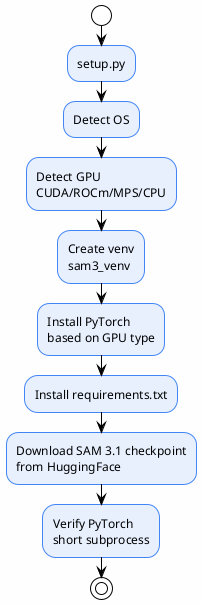

# 17 — Deployment

> Deploying the pipeline with Docker
>
> **Status**: Verified — cross-checked against `Dockerfile`, `docker-compose.yml`, `setup.py`

---

## Deployment Architecture



| Step | Details |
|---------|-----------|
| Hardware detect | `HardwareInfo` class — OS, RAM, GPU, VRAM |
| Venv | `sam3_auto_label/sam3_venv` |
| PyTorch | `torch==2.5.1` + `torchvision==0.20.1` |
| Index URL | CUDA: `cu121`, ROCm: `rocm6.1`, CPU: `cpu`, MPS: PyPI |
| Checkpoint | `sam3.1_multiplex.pt` from HuggingFace |

> `setup.py:1-405`

### ⚠️ Checkpoint Path Inconsistency

| Location | Path |
|----|------|
| `setup.py:35` downloads to | `models/sam3/sam3.1_multiplex.pt` |
| `config.py:112-113` looks for | `checkpoints/sam3.1_multiplex.pt` |
| `README.md:14` references | `checkpoints/` |
| `docker-compose.yml` references | `./checkpoints` |

**Must manually move or symlink the file after setup**

---

## What Typical Systems Usually Have (but this code does not)

### ❌ API Server Deployment

Typical approach:
```
User → API Server → Job Queue → GPU Worker → Annotation Storage
```

**Actual code**: batch CLI — no API server, no job queue, no worker pool (only an internal ThreadPoolExecutor)

### ❌ Health Check

No HEALTHCHECK in Dockerfile — not suitable for long-running services (but this system is a batch process, not a service)

### ❌ Monitoring / Alerting

No Prometheus metrics, no log aggregation, no alerting

---

## Deployment Risks

| Risk | Level | Note |
|-----------|-------|---------|
| Checkpoint path mismatch | High | setup.py installs to `models/sam3/` but config looks in `checkpoints/` |
| No health check | Medium | If used as a service (not the current case) |
| No resource limits | Medium | Docker does not set memory/CPU limits |
| 3.34 GB model downloaded each time | Medium | Not baked into image — uses volume mount |

---

## References

- `Dockerfile:1-77`
- `docker-compose.yml:1-91`
- `setup.py:1-405`
- `auto_label.sh:1-51`
