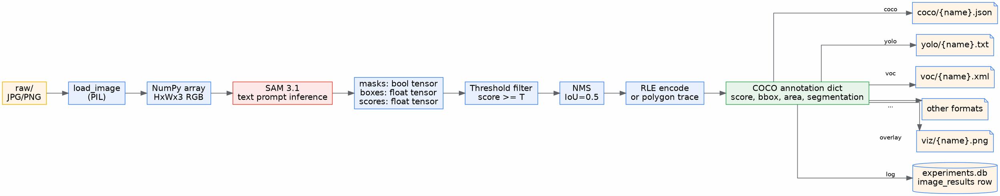
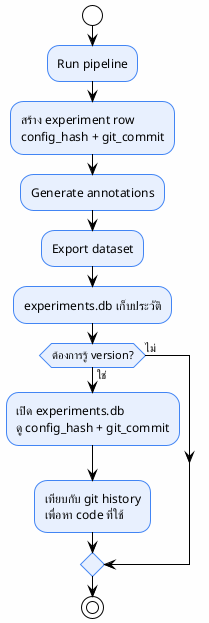

# 04 — Data Flow

> ข้อมูลเดินทางจากไหน → ถูกแปลงอะไร → ไปอยู่ที่ไหน
>
> **Status**: Verified — สอบกับ `src/config.py:95-109` (path properties) และ `src/batch_segment.py`

---

## โครงสร้างโฟลเดอร์ Input/Output

```
data/
├── raw/                              ← INPUT: ภาพดิบ
│   ├── IMG_001.jpg
│   ├── IMG_002.png
│   └── ...
│
└── sam_outputs_ground_truth/         ← OUTPUT: ผลลัพธ์ทั้งหมด
    ├── coco/
    │   ├── IMG_001.json              ← per-image COCO (cache สำหรับ resume)
    │   ├── IMG_002.json
    │   └── annotations.json          ← combined COCO dataset (สุดท้าย)
    │
    ├── viz/
    │   ├── IMG_001.png               ← overlay visualization
    │   └── IMG_002.png
    │
    ├── yolo/                         ← (ถ้าเลือก format: yolo)
    │   ├── IMG_001.txt
    │   ├── data.yaml
    │   └── classes.txt
    │
    ├── voc/                          ← (ถ้าเลือก format: voc)
    │   └── IMG_001.xml
    │
    ├── labelme/                      ← (ถ้าเลือก format: labelme)
    │   └── IMG_001.json
    │
    ├── masks/                        ← (ถ้าเลือก format: masks)
    │   ├── IMG_001_ann1_cat1.png
    │   └── IMG_001_ann2_cat2.png
    │
    ├── experiments.db                ← SQLite experiment log
    ├── checkpoint.json               ← progress checkpoint (ลบเมื่อจบ ถ้า clear_on_success)
    └── errors.json                   ← (ถ้ามีภาพที่ error) summary ของ errors
```

> ที่มา: `src/config.py:95-109` — `coco_path`, `viz_path`, `masks_path`, `combined_json_path`

---

## Data Flow Diagram



---

## Provenance Metadata

### ต่อหนึ่ง Experiment Run

| Field | ที่มา | ตัวอย่าง |
|-------|------|---------|
| `id` | `run_{timestamp}_{config_hash}_{suffix}` | `run_20260901_143022_a1b2c3d4e5f6_x7y9` |
| `started_at` | ISO timestamp | `2026-09-01T14:30:22.123456` |
| `ended_at` | ISO timestamp | `2026-09-01T15:05:11.789012` |
| `status` | `running` / `completed` / `failed` | `completed` |
| `config_hash` | MD5 hash ของ threshold+resolution+device+categories | `a1b2c3d4e5f6` |
| `config_json` | JSON ของ config ที่ใช้ | `{"threshold": 0.25, ...}` |
| `num_images` | จำนวนภาพทั้งหมด | `1500` |
| `num_annotations` | จำนวน annotation รวม | `12340` |
| `total_time` | วินาทีรวม | `2100.5` |
| `avg_time_per_image` | วินาทีเฉลี่ย | `1.4` |
| `errors` | จำนวนภาพที่ error | `3` |
| `git_commit` | `git rev-parse --short HEAD` | `9d956c1` |

> `src/tracker.py:33-52` (schema), `src/tracker.py:98-124` (start_run)

### ต่อหนึ่ง Image

| Field | ที่มา | ตัวอย่าง |
|-------|------|---------|
| `experiment_id` | FK → experiments | `run_20260901_...` |
| `image_name` | ชื่อไฟล์ | `IMG_001.jpg` |
| `num_annotations` | จำนวน detection ในภาพ | `8` |
| `time_seconds` | เวลา inference ภาพนี้ | `1.35` |

> `src/tracker.py:62-69` (schema), `src/tracker.py:126-141` (log_image_result)

### ต่อหนึ่ง Annotation (ใน COCO JSON)

@import "../../sam3_auto_label/src/inference.py" {line_begin=491 line_end=520 title="inference.py:491-520 — annotation dict construction"}

---

## สิ่งที่ระบบทั่วไปมักมี (แต่โค้ดนี้ไม่มี)

| Provenance field ทั่วไป | สถานะ | ผลกระทบ |
|-------------------------|-------|---------|
| `model_version` | ❌ ไม่มี field โดยตรง — มีแค่ `config_hash` ที่ hash รวม config | ไม่รู้ว่าใช้ checkpoint เวอร์ชันไหน |
| `prompt_version` | ❌ ไม่มี — prompt อยู่ใน `config_json` แต่ไม่มี version | เปลี่ยน prompt แล้วไม่รู้ว่า label เก่าใช้ prompt ไหน |
| `pipeline_version` | ❌ ไม่มี — มี `git_commit` เป็นตัวแทน | พอใช้ได้ถ้า commit ไม่ dirty |
| `annotation_source` (`auto`/`reviewed`) | ❌ ไม่มี | ทุก annotation เป็น `auto` โดยปริยาย ไม่มีทางแยก |
| `review_status` | ❌ ไม่มี | ไม่มี review process |

> **ความเสี่ยง**: ถ้าเปลี่ยน model checkpoint หรือ prompt แล้วรันใหม่ จะไม่สามารถบอกได้จาก `experiments.db` ว่า annotation เก่าใช้ model/prompt ไหน (นอกจากเปิด `config_json` ดู)

---

## อ้างอิง

- `src/config.py:95-109` — path properties
- `src/tracker.py:33-71` — SQLite schema
- `src/inference.py:491-520` — annotation dict
- `src/batch_segment.py:155-156` — output dir creation

---


# 11 — Dataset Versioning

> การ track เวอร์ชันของ dataset ที่ generate ออกมา
>
> **Status**: Verified — สอบกับ `src/tracker.py`
>
> **⚠️ สำคัญ**: ระบบปัจจุบัน **ไม่มี dataset versioning อย่างเป็นทางการ** — มีเพียง `config_hash` และ `git_commit` เป็นตัวแทน

---

## สิ่งที่มีจริง

### Config Hash

@import "../../sam3_auto_label/src/tracker.py" {line_begin=73 line_end=83 title="tracker.py:73-83 — _config_hash"}

| รายการ | ค่า |
|--------|-----|
| Algorithm | MD5 (12 ตัวแรก) |
| Hash รวม | threshold, resolution, device, categories (id+name+prompt) |
| ไม่รวม | checkpoint version, prompt version, pipeline version, output formats |

### Git Commit

@import "../../sam3_auto_label/src/tracker.py" {line_begin=85 line_end=96 title="tracker.py:85-96 — _git_commit"}

| รายการ | ค่า |
|--------|-----|
| กลไก | `git rev-parse --short HEAD` |
| Timeout | 5 วินาที |
| Fallback | `"unknown"` ถ้า fail |

### Experiments DB Schema



### วิธี track version ในปัจจุบัน (manual)

1. ดู `experiments.db` → หา run ที่สนใจ
2. อ่าน `config_hash` และ `git_commit`
3. `git show <commit>` เพื่อดู code ที่ใช้ตอนนั้น
4. อ่าน `config_json` เพื่อดู threshold/prompt ที่ใช้

> **ไม่สะดวก** — ต้อง manual ทุกครั้ง ไม่มี CLI สำหรับ query

---

## ความเสี่ยงด้าน Versioning

| ความเสี่ยง | ระดับ | หมายเหตุ |
|-----------|-------|---------|
| เปลี่ยน checkpoint แล้วไม่รู้ | สูง | `config_hash` ไม่ได้ hash checkpoint content |
| เปลี่ยน prompt แล้ว label เปลี่ยน | สูง | มี prompt ใน `config_json` แต่ไม่มี version tag |
| Git commit dirty | กลาง | `git_commit` จะเป็น HEAD แต่ code จริงอาจถูกแก้แล้วไม่ commit |
| ลบ `experiments.db` | สูง | หายหมด — ไม่มี backup mechanism |

---

## YOLO26 Data Flow (RQ2)

```dot {align="center"}
digraph YOLODataFlow {
  bgcolor="#FEFEFE";
  splines=ortho;
  rankdir=LR;
  node [shape=box, style="rounded,filled", fillcolor="#E8F0FE", fontname="Helvetica"];
  edge [color="#4285F4", fontname="Helvetica", fontsize=10];

  SAM_GT [label="SAM 3.1 Output\n(data/sam_outputs_ground_truth/)", fillcolor="#E8F5E9"];
  VERIFY [label="Human Verification\n(manual)"];
  DS_V1 [label="Dataset v1\n(yolo_detection_dataset_version_1/)"];
  DS_V2 [label="Dataset v2\n(combined_coco_dataset_version_2/)", fillcolor="#FFF8E1"];
  CONVERT [label="Convert COCO → YOLO format"];
  SPLIT [label="Split\ntrain/val/test\n(335/95/50)"];
  TRAIN [label="Train 4 Models\n(n/s detect + n/s seg)"];
  MLF [label="MLflow\nTracking", shape=cylinder, fillcolor="#FCE8E6"];
  EVAL [label="Evaluate\n(test set)"];
  ONNX [label="ONNX Export"];
  REPORT [label="report.pdf", shape=note, fillcolor="#FFF8E1"];

  SAM_GT -> VERIFY;
  VERIFY -> DS_V1;
  DS_V1 -> DS_V2 [label="improved"];
  DS_V2 -> CONVERT;
  CONVERT -> SPLIT;
  SPLIT -> TRAIN;
  TRAIN -> MLF [label="metrics"];
  TRAIN -> EVAL [label="weights"];
  EVAL -> ONNX;
  EVAL -> REPORT;
}
```



### Dataset Versions

| Version | Path | ใช้สำหรับ |
|---------|------|----------|
| v1 | `yolo26_ppe/data/yolo_detection_dataset_version_1/` | เทรนรอบแรก |
| v1 seg | `yolo26_ppe/data/yolo_segmentation_dataset_version_1/` | เทรน seg รอบแรก |
| v2 | `yolo26_ppe/data/yolo_detection_dataset_version_2/` | เทรนรอบปรับปรุง |
| v2 seg | `yolo26_ppe/data/yolo_segmentation_dataset_version_2/` | เทรน seg รอบปรับปรุง |
| v2 combined | `yolo26_ppe/data/combined_coco_dataset_version_2/` | COCO รวมก่อน convert |

> ที่มา: `yolo26_ppe/data/` directory listing

---

## อ้างอิง

- `src/tracker.py:33-71` — schema
- `src/tracker.py:73-83` — config_hash
- `src/tracker.py:85-96` — git_commit
- `yolo26_ppe/data/` — dataset versions
- `yolo26_ppe/reports/source/report.tex:345-429` — dataset chapter
