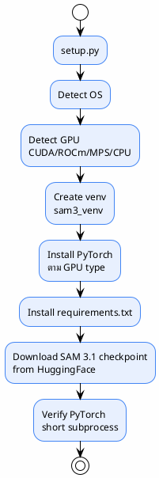

# 17 — Deployment

> การ deploy pipeline ด้วย Docker
>
> **Status**: Verified — สอบกับ `Dockerfile`, `docker-compose.yml`, `setup.py`

---

## Deployment Architecture



| ขั้นตอน | รายละเอียด |
|---------|-----------|
| Hardware detect | `HardwareInfo` class — OS, RAM, GPU, VRAM |
| Venv | `sam3_auto_label/sam3_venv` |
| PyTorch | `torch==2.5.1` + `torchvision==0.20.1` |
| Index URL | CUDA: `cu121`, ROCm: `rocm6.1`, CPU: `cpu`, MPS: PyPI |
| Checkpoint | `sam3.1_multiplex.pt` from HuggingFace |

> `setup.py:1-405`

### ⚠️ Checkpoint Path Inconsistency

| ที่ | Path |
|----|------|
| `setup.py:35` ดาวน์โหลดไป | `models/sam3/sam3.1_multiplex.pt` |
| `config.py:112-113` มองหา | `checkpoints/sam3.1_multiplex.pt` |
| `README.md:14` อ้างถึง | `checkpoints/` |
| `docker-compose.yml` อ้างถึง | `./checkpoints` |

**ต้องย้ายไฟล์หรือ symlink ด้วยตนเองหลัง setup**

---

## สิ่งที่ระบบทั่วไปมักมี (แต่โค้ดนี้ไม่มี)

### ❌ API Server Deployment

แนวทางทั่วไป:
```
User → API Server → Job Queue → GPU Worker → Annotation Storage
```

**โค้ดจริง**: batch CLI — ไม่มี API server, ไม่มี job queue, ไม่มี worker pool (มีแค่ ThreadPoolExecutor ภายใน)

### ❌ Health Check

ไม่มี HEALTHCHECK ใน Dockerfile — ไม่เหมาะสำหรับ long-running service (แต่ระบบนี้เป็น batch ไม่ใช่ service)

### ❌ Monitoring / Alerting

ไม่มี Prometheus metrics, ไม่มี log aggregation, ไม่มี alerting

---

## ความเสี่ยงด้าน Deployment

| ความเสี่ยง | ระดับ | หมายเหตุ |
|-----------|-------|---------|
| Checkpoint path ไม่ตรง | สูง | setup.py ลงที่ `models/sam3/` แต่ config มองที่ `checkpoints/` |
| ไม่มี health check | กลาง | ถ้าใช้เป็น service (ไม่ใช่กรณีปัจจุบัน) |
| ไม่มี resource limits | กลาง | Docker ไม่ได้ตั้ง memory/CPU limits |
| Model 3.34 GB ต้องดาวน์โหลดทุกครั้ง | กลาง | ไม่ได้ bake เข้า image — ใช้ volume mount |

---

## อ้างอิง

- `Dockerfile:1-77`
- `docker-compose.yml:1-91`
- `setup.py:1-405`
- `run_pipeline.sh:1-51`
