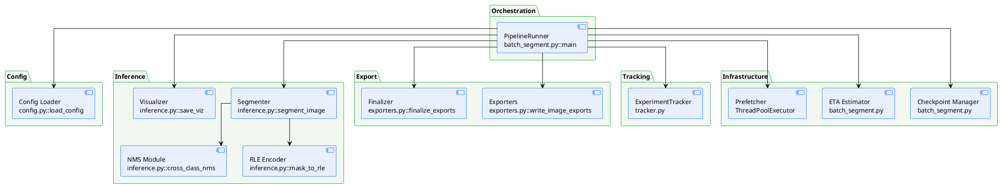

# 05 — Component Design

> Responsibilities of each component in the system
>
> **Status**: Verified — cross-checked against all files in `src/`

---

## Component Overview

---

## Component Details

### 1. PipelineRunner (`batch_segment.py::main`)

| Item | Value |
|--------|-----|
| File | `src/batch_segment.py:130-435` |
| Responsibility | Orchestrates the entire pipeline — loads config, builds model, runs loop, calls export/tracker |
| Input | CLI args + config path |
| Output | Annotation files + experiment log |
| Dependencies | `config.py`, `inference.py`, `exporters.py`, `tracker.py` |

### 2. Config Loader (`config.py`)

| Item | Value |
|--------|-----|
| File | `src/config.py:128-211` (`load_config`), `src/config.py:214-253` (`save_config`) |
| Responsibility | Reads YAML, validates, creates `Config` dataclass |
| Input | YAML file path |
| Output | `Config` object (contains `Category[]`, `InferenceConfig`, `AnnotationConfig`, `OutputConfig`, `CheckpointConfig`) |
| Validation | category fields, threshold range $[0,1]$, annotation switches, encoding (rle/polygon), output formats vs `SUPPORTED_FORMATS` |

### 3. Segmenter (`inference.py::segment_image`)

| Item | Value |
|--------|-----|
| File | `src/inference.py:382-520` |
| Responsibility | Segments a single image — iterates per category, sets text prompt, runs inference, applies threshold, NMS, encodes |
| Input | `processor`, `image` (PIL), `img_id`, `ann_id`, `cfg` |
| Output | List of annotation dicts |
| Key logic | bfloat16 autocast on CUDA, per-category threshold, cross-class NMS |

### 4. NMS Module (`inference.py::cross_class_nms`)

| Item | Value |
|--------|-----|
| File | `src/inference.py:189-245` (CPU), `src/inference.py:247-313` (GPU) |
| Responsibility | Removes cross-class overlap — if a mask from class A overlaps class B by more than $\text{IoU}=0.5$, keeps the one with the higher score |
| Input | Stacked detections from all classes |
| Output | Filtered detections |
| GPU path | `sam3.perflib.gpu_mask_iou` → fallback `torchvision.ops.nms` (bbox) |

### 5. RLE Encoder (`inference.py::mask_to_rle`)

| Item | Value |
|--------|-----|
| File | `src/inference.py:22-84` |
| Responsibility | Converts bool mask → RLE counts (COCO format) |
| GPU path | `sam3.perflib.robust_rle_encode` → fallback CPU |

### 6. Visualizer (`inference.py::save_viz`)

| Item | Value |
|--------|-----|
| File | `src/inference.py:591-641` |
| Responsibility | Generates overlay image — colored masks + bounding box + label + score |
| Input | image, annotations, output path |
| Output | `viz/{name}.png` |
| Library | OpenCV (headless) — 10-50x faster than matplotlib |

### 7. Exporters (`exporters.py`)

| Item | Value |
|--------|-----|
| File | `src/exporters.py:577-589` (registry), `src/exporters.py:608-623` (entry) |
| Responsibility | Converts annotations to 11 formats — per-image and finalize |
| Input | annotation list, image info, cfg |
| Output | Files in `<format>/` directory |

### 8. ExperimentTracker (`tracker.py`)

| Item | Value |
|--------|-----|
| File | `src/tracker.py:23-229` |
| Responsibility | Logs all run history to SQLite + JSON artifacts |
| Input | config, image list, per-image results, summary metrics |
| Output | `experiments.db` |
| Not used | MLflow (intentionally uses SQLite instead to avoid running a server) |

### 9. Checkpoint Manager (`batch_segment.py`)

| Item | Value |
|--------|-----|
| File | `src/batch_segment.py:52-83` |
| Responsibility | Save/load/delete checkpoint — atomic write of progress state |
| Input | processed image list, next image index |
| Output | `checkpoint.json` |
| Behavior | resume / fresh / interactive prompt |

### 10. ETA Estimator (`batch_segment.py`)

| Item | Value |
|--------|-----|
| File | `src/batch_segment.py:85-90` (`format_eta`), `src/batch_segment.py:234-243, 374-382` |
| Responsibility | Calculates rolling average time/image and ETA |
| Initial heuristic | $\text{total\_images} \times 40$ seconds (first run) |

### 11. Prefetcher (`batch_segment.py`)

| Item | Value |
|--------|-----|
| File | `src/batch_segment.py:270, 304, 316-320` |
| Responsibility | Loads the next image in parallel with inference on the current image (ThreadPoolExecutor, 1 worker) |

---

## Components Typical Systems Usually Have (but this code does not)

| Common component | Status | Note |
|--------------------|-------|---------|
| ImageLoader (separate) | ⚠️ Integrated into `batch_segment.py::load_image` | Not a separate class |
| Preprocessor | ❌ Not present | SAM 3.1 processor handles resizing internally (`resolution` param) |
| PromptGenerator | ❌ Not present | Prompts come directly from config |
| Classifier | ❌ Not present | SAM 3.1 provides class from text prompt |
| ConfidenceScorer | ❌ Not present (as a separate class) | Uses raw scores from model + threshold in `segment_image` |
| LabelValidator | ❌ Not present | No annotation validation before export |
| AutoLabeler / HumanReviewer | ❌ Not present | All detections passing threshold → annotation immediately |
| Segmenter Interface (pluggable) | ❌ Not present | `build_model` is directly coupled to SAM 3.1 — changing the model requires modifying `inference.py` |

---

## References

- `src/batch_segment.py:130-435` — main orchestration
- `src/config.py:128-211` — config validation
- `src/inference.py:382-520` — segment_image
- `src/exporters.py:577-589` — EXPORTERS registry
- `src/tracker.py:23-229` — ExperimentTracker
