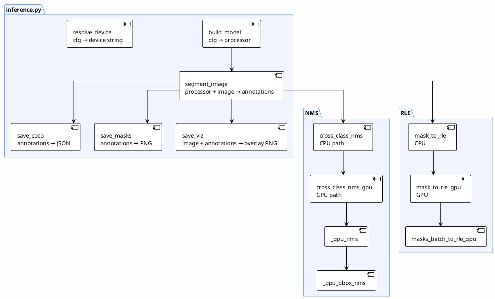
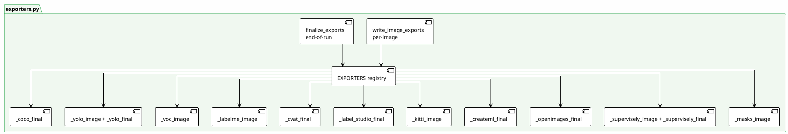

# 06 — Class Diagram

> Class structure and relationships in the system
>
> **Status**: Verified — cross-checked against `src/config.py`, `src/inference.py`, `src/tracker.py`, `src/exporters.py`

---

## Class Diagram

### `exporters.py` — Export Registry

---

## What Typical Systems Usually Have (but this code does not)

| Common class | Status | Note |
|----------------|-------|---------|
| `Segmenter` interface (abstract) | ❌ | `build_model` is directly coupled to SAM 3.1 |
| `SAM3Segmenter`, `SAM2Segmenter`, `YOLOSegmenter` | ❌ | No polymorphism — changing the model requires modifying `inference.py` |
| `ImageLoader` class | ❌ | Implemented as a `load_image` function in `batch_segment.py` |
| `Preprocessor` class | ❌ | SAM processor handles resizing internally |
| `PromptGenerator` class | ❌ | Prompts come directly from config |
| `MaskProcessor` class | ❌ | Distributed across `inference.py` (NMS, RLE, clamp) |
| `Classifier` class | ❌ | No separate classifier |
| `ConfidenceScorer` class | ❌ | Uses raw scores from the model |
| `LabelValidator` class | ❌ | No validation before export |
| `AutoLabeler`, `HumanReviewer` class | ❌ | No review process |
| `DatasetExporter` class | ❌ | Implemented as a registry of functions, not a class |

---

## References

- `src/config.py:10-125` — dataclasses
- `src/tracker.py:23-229` — ExperimentTracker
- `src/inference.py:347-365` — build_model (not a class)
- `src/exporters.py:577-589` — EXPORTERS registry (not a class)
