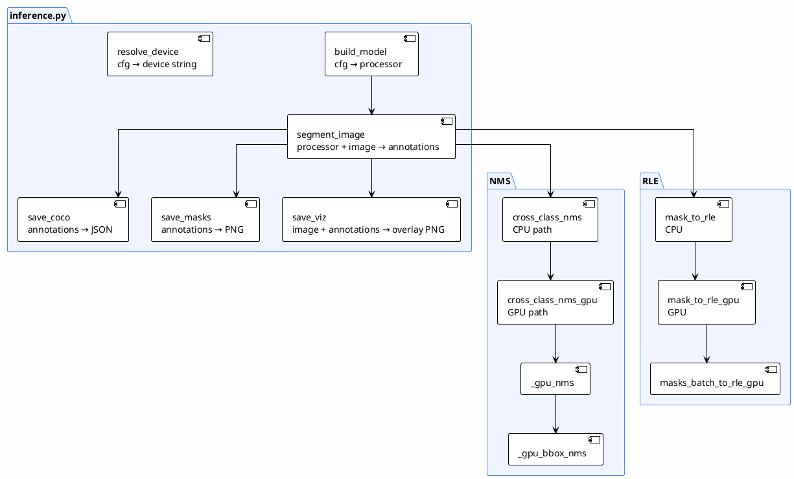
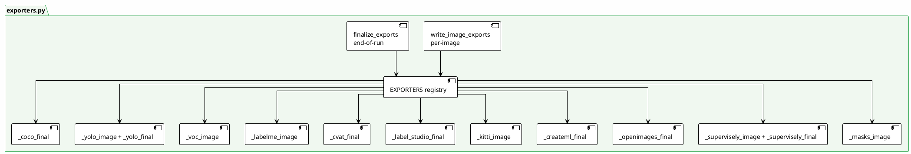

# 06 — Class Diagram

> โครงสร้าง class และความสัมพันธ์ในระบบ
>
> **Status**: Verified — สอบกับ `src/config.py`, `src/inference.py`, `src/tracker.py`, `src/exporters.py`

---

## Class Diagram

### `exporters.py` — Export Registry

---

## สิ่งที่ระบบทั่วไปมักมี (แต่โค้ดนี้ไม่มี)

| Class ทั่วไป | สถานะ | หมายเหตุ |
|----------------|-------|---------|
| `Segmenter` interface (abstract) | ❌ | `build_model` ผูกกับ SAM 3.1 โดยตรง |
| `SAM3Segmenter`, `SAM2Segmenter`, `YOLOSegmenter` | ❌ | ไม่มี polymorphism — เปลี่ยน model ต้องแก้ `inference.py` |
| `ImageLoader` class | ❌ | เป็นฟังก์ชัน `load_image` ใน `batch_segment.py` |
| `Preprocessor` class | ❌ | SAM processor จัดการ resize เอง |
| `PromptGenerator` class | ❌ | prompt มาจาก config ตรง ๆ |
| `MaskProcessor` class | ❌ | กระจายอยู่ใน `inference.py` (NMS, RLE, clamp) |
| `Classifier` class | ❌ | ไม่มี classifier แยก |
| `ConfidenceScorer` class | ❌ | ใช้ score ดิบจาก model |
| `LabelValidator` class | ❌ | ไม่มี validation ก่อน export |
| `AutoLabeler`, `HumanReviewer` class | ❌ | ไม่มี review process |
| `DatasetExporter` class | ❌ | เป็น registry ของฟังก์ชัน ไม่ใช่ class |

---

## อ้างอิง

- `src/config.py:10-125` — dataclasses
- `src/tracker.py:23-229` — ExperimentTracker
- `src/inference.py:347-365` — build_model (ไม่ใช่ class)
- `src/exporters.py:577-589` — EXPORTERS registry (ไม่ใช่ class)
