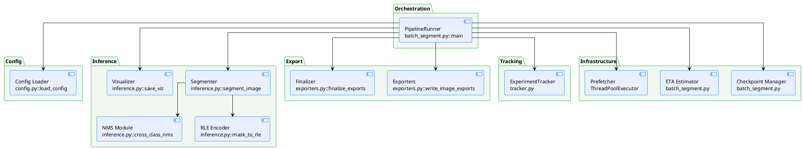

# 05 — Component Design

> หน้าที่ของแต่ละ component ในระบบ
>
> **Status**: Verified — สอบกับ `src/` ทุกไฟล์

---

## Component ภาพรวม

---

## รายละเอียด Component

### 1. PipelineRunner (`batch_segment.py::main`)

| รายการ | ค่า |
|--------|-----|
| File | `src/batch_segment.py:130-435` |
| หน้าที่ | orchestrate ทั้ง pipeline — โหลด config, สร้าง model, วน loop, เรียก export/tracker |
| Input | CLI args + config path |
| Output | annotation files + experiment log |
| Dependencies | `config.py`, `inference.py`, `exporters.py`, `tracker.py` |

### 2. Config Loader (`config.py`)

| รายการ | ค่า |
|--------|-----|
| File | `src/config.py:128-211` (`load_config`), `src/config.py:214-253` (`save_config`) |
| หน้าที่ | อ่าน YAML, validate, สร้าง `Config` dataclass |
| Input | YAML file path |
| Output | `Config` object (มี `Category[]`, `InferenceConfig`, `AnnotationConfig`, `OutputConfig`, `CheckpointConfig`) |
| Validation | category fields, threshold range $[0,1]$, annotation switches, encoding (rle/polygon), output formats vs `SUPPORTED_FORMATS` |

### 3. Segmenter (`inference.py::segment_image`)

| รายการ | ค่า |
|--------|-----|
| File | `src/inference.py:382-520` |
| หน้าที่ | segment ภาพเดียว — วน per category, set text prompt, inference, threshold, NMS, encode |
| Input | `processor`, `image` (PIL), `img_id`, `ann_id`, `cfg` |
| Output | list ของ annotation dicts |
| Key logic | bfloat16 autocast บน CUDA, per-category threshold, cross-class NMS |

### 4. NMS Module (`inference.py::cross_class_nms`)

| รายการ | ค่า |
|--------|-----|
| File | `src/inference.py:189-245` (CPU), `src/inference.py:247-313` (GPU) |
| หน้าที่ | กำจัด overlap ข้ามคลาส — ถ้า mask ของคลาส A overlap กับคลาส B มากเกิน $\text{IoU}=0.5$ จะเก็บอันที่ score สูงกว่า |
| Input | stacked detections ทุกคลาส |
| Output | filtered detections |
| GPU path | `sam3.perflib.gpu_mask_iou` → fallback `torchvision.ops.nms` (bbox) |

### 5. RLE Encoder (`inference.py::mask_to_rle`)

| รายการ | ค่า |
|--------|-----|
| File | `src/inference.py:22-84` |
| หน้าที่ | แปลง bool mask → RLE counts (COCO format) |
| GPU path | `sam3.perflib.robust_rle_encode` → fallback CPU |

### 6. Visualizer (`inference.py::save_viz`)

| รายการ | ค่า |
|--------|-----|
| File | `src/inference.py:591-641` |
| หน้าที่ | สร้างภาพ overlay — mask สีต่าง ๆ + bounding box + label + score |
| Input | image, annotations, output path |
| Output | `viz/{name}.png` |
| Library | OpenCV (headless) — เร็วกว่า matplotlib 10-50x |

### 7. Exporters (`exporters.py`)

| รายการ | ค่า |
|--------|-----|
| File | `src/exporters.py:577-589` (registry), `src/exporters.py:608-623` (entry) |
| หน้าที่ | แปลง annotation เป็น 11 ฟอร์แมต — per-image และ finalize |
| Input | annotation list, image info, cfg |
| Output | files ใน `<format>/` directory |

### 8. ExperimentTracker (`tracker.py`)

| รายการ | ค่า |
|--------|-----|
| File | `src/tracker.py:23-229` |
| หน้าที่ | บันทึกประวัติทุก run ลง SQLite + JSON artifacts |
| Input | config, image list, per-image results, summary metrics |
| Output | `experiments.db` |
| ไม่ใช้ | MLflow (ตั้งใจใช้ SQLite แทนเพื่อไม่ต้องลง server) |

### 9. Checkpoint Manager (`batch_segment.py`)

| รายการ | ค่า |
|--------|-----|
| File | `src/batch_segment.py:52-83` |
| หน้าที่ | save/load/delete checkpoint — atomic write ของ progress state |
| Input | processed image list, next image index |
| Output | `checkpoint.json` |
| Behavior | resume / fresh / interactive prompt |

### 10. ETA Estimator (`batch_segment.py`)

| รายการ | ค่า |
|--------|-----|
| File | `src/batch_segment.py:85-90` (`format_eta`), `src/batch_segment.py:234-243, 374-382` |
| หน้าที่ | คำนวณ rolling average time/image และ ETA |
| Initial heuristic | $\text{total\_images} \times 40$ seconds (first run) |

### 11. Prefetcher (`batch_segment.py`)

| รายการ | ค่า |
|--------|-----|
| File | `src/batch_segment.py:270, 304, 316-320` |
| หน้าที่ | โหลดภาพถัดไปขนานกับ inference ภาพปัจจุบัน (ThreadPoolExecutor, 1 worker) |

---

## Component ที่ระบบทั่วไปมักมี (แต่โค้ดนี้ไม่มี)

| Component ทั่วไป | สถานะ | หมายเหตุ |
|--------------------|-------|---------|
| ImageLoader (แยก) | ⚠️ รวมอยู่ใน `batch_segment.py::load_image` | ไม่ได้เป็น class แยก |
| Preprocessor | ❌ ไม่มี | SAM 3.1 processor จัดการ resize เอง (`resolution` param) |
| PromptGenerator | ❌ ไม่มี | prompt มาจาก config ตรง ๆ |
| Classifier | ❌ ไม่มี | SAM 3.1 ให้ class จาก text prompt |
| ConfidenceScorer | ❌ ไม่มี (เป็น class แยก) | ใช้ score ดิบจาก model + threshold ใน `segment_image` |
| LabelValidator | ❌ ไม่มี | ไม่มี validation ของ annotation ก่อน export |
| AutoLabeler / HumanReviewer | ❌ ไม่มี | ทุก detection ที่ผ่าน threshold → annotation ทันที |
| Segmenter Interface (pluggable) | ❌ ไม่มี | `build_model` ผูกกับ SAM 3.1 โดยตรง — เปลี่ยน model ต้องแก้ `inference.py` |

---

## อ้างอิง

- `src/batch_segment.py:130-435` — main orchestration
- `src/config.py:128-211` — config validation
- `src/inference.py:382-520` — segment_image
- `src/exporters.py:577-589` — EXPORTERS registry
- `src/tracker.py:23-229` — ExperimentTracker
