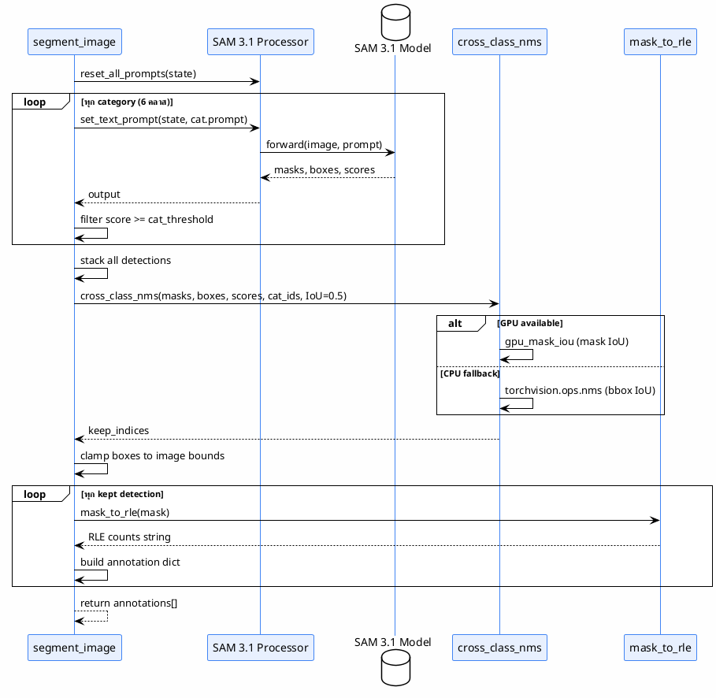
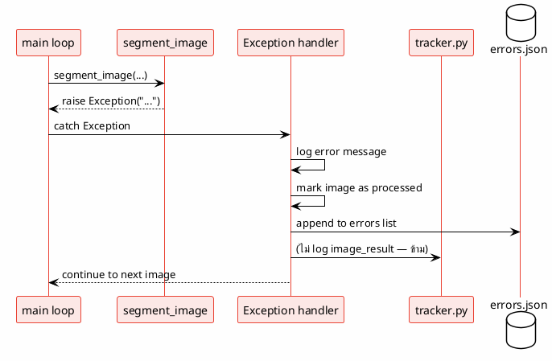

# Sequence Diagram

> ลำดับการเรียกฟังก์ชันระหว่าง component ใน 1 รอบ inference
>
> **Status**: Verified — สอบกับ `src/batch_segment.py:main()` และ `src/inference.py:segment_image()`

---

## Sequence: รัน pipeline เต็มรอบ

---

## Sequence: Error path (ภาพที่ inference ล้มเหลว)

> **ไม่มี retry** — ภาพที่ error จะถูกข้ามและไม่กลับมาประมวลผลใหม่

---

## อ้างอิง

- `src/batch_segment.py:130-435` — main loop
- `src/inference.py:382-520` — segment_image
- `src/inference.py:189-313` — cross_class_nms
- `src/inference.py:22-84` — mask_to_rle
