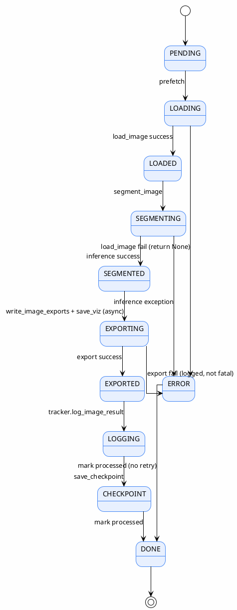
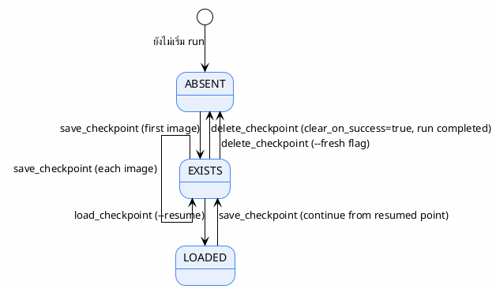

# State Diagram

> สถานะของระบบและการเปลี่ยนสถานะ
>
> **Status**: Verified — สอบกับ `src/batch_segment.py` และ `src/tracker.py`

---

## State: Pipeline Run

---

## State: Experiment (tracker.py)

> `src/batch_segment.py:52-83` — load/save/delete checkpoint

---

## อ้างอิง

- `src/batch_segment.py:130-435` — main state flow
- `src/batch_segment.py:52-83` — checkpoint state
- `src/tracker.py:98-168` — experiment state
