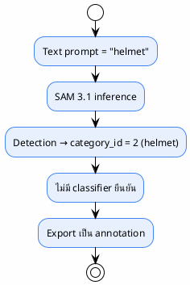

# Classifier

> Secondary classifier สำหรับยืนยัน label
>
> **Status**: Verified — **❌ ไม่มีในโค้ดจริง**
>
> ไฟล์นี้มีอยู่เพื่อระบุชัดเจนว่าระบบทั่วไปมักมี classifier แยก แต่ `sam3_auto_label` ไม่มี

---

## สถานะ: ไม่มีในระบบ

> ไม่มีขั้นตอน "ยืนยัน" หรือ "ตรวจสอบ" label หลังจาก SAM 3.1 ให้ผล — ทุก detection ที่ผ่าน threshold + NMS จะกลายเป็น annotation สุดท้ายทันที

---

## ความเสี่ยงจากการไม่มี Classifier

| ความเสี่ยง | ระดับ | หมายเหตุ |
|-----------|-------|---------|
| False positive ปนเข้า dataset | สูง | ไม่มีกลไกยืนยัน — threshold ต่ำ (0.25) ปล่อยผ่านง่าย |
| คลาสสับสน (boots vs shoes) | กลาง | text prompt อาจ detect ซ้อนกัน — พึ่ง NMS |
| ไม่รู้คุณภาพ label | สูง | ไม่มี quality score นอกจาก SAM raw score |

---

## อ้างอิง

- `src/inference.py:382-520` — segment_image (ไม่มี classifier step)
- `config/ppe_6class.yaml` — prompt กำหนด class โดยตรง
