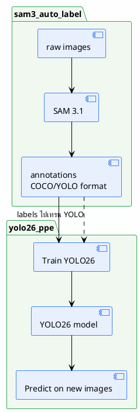

# 07 — Models

> โมเดลที่ใช้ในระบบ — ปัจจุบันมีเพียง SAM 3.1
>
> **Status**: Verified — สอบกับ `src/inference.py`, `setup.py`

---

## SAM 3.1

### Role

Segmentation — รับภาพ + text prompt แล้วคืน mask + bounding box + score

### Input

| รายการ | ค่า |
|--------|-----|
| Image | PIL Image → NumPy array ($H \times W \times 3$, RGB) |
| Prompt | text string (เช่น `"person"`, `"helmet"`) |
| Resolution | 1008 px (configurable) |

### Output

| รายการ | ค่า |
|--------|-----|
| Masks | bool tensor $[N, H, W]$ |
| Boxes | float tensor $[N, 4]$ (xywh) |
| Scores | float tensor $[N]$ ($0.0$–$1.0$) |

### Model Version

| รายการ | ค่า |
|--------|-----|
| Checkpoint | `sam3.1_multiplex.pt` |
| ขนาด | $3340 \text{ MB}$ |
| URL | `https://huggingface.co/facebook/sam3.1/resolve/main/sam3.1_multiplex.pt` |
| Vendored code | `sam3/` directory (ห้ามแก้) |

> `setup.py:35-36`

### Hardware

> SAM 3.1 สร้าง label อัตโนมัติ → label เหล่านั้นถูกใช้เทรน YOLO26 ใน pipeline ถัดไป (`pipeline_cli.py` orchestrate ทั้งสองส่วน)

---

## อ้างอิง

- `src/inference.py:347-365` — `build_model()`
- `src/inference.py:382-520` — `segment_image()`
- `src/inference.py:315-340` — `resolve_device()`
- `setup.py:35-36` — checkpoint URL
- `yolo26_ppe/reports/inputs/sam3_benchmark_results.json` — benchmark
