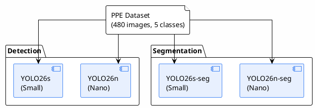
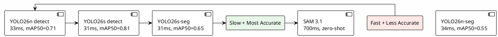

# YOLO26 Models

> 4 โมเดล YOLO26 ที่เทรนบนชุดข้อมูล PPE ground truth
>
> **Status**: Verified — สอบกับ `yolo26_ppe/reports/inputs/final_eval_results.json`, `yolo26_ppe/reports/metrics/comparison_report.md`

---

## 4 โมเดลที่เทรน

---

## Overall Results

> ที่มา: `yolo26_ppe/reports/inputs/final_eval_results.json`

| Model | Task | mAP50 | mAP50-95 | Precision | Recall | Inference (ms) | Size (MB) |
|-------|------|-------|----------|-----------|--------|----------------|-----------|
| YOLO26n | detect | 0.712 | 0.514 | 0.777 | 0.665 | 33.0 | 10.0 |
| YOLO26s | detect | **0.808** | **0.644** | **0.862** | **0.758** | 31.3 | 38.3 |
| YOLO26n-seg | segment | 0.547 | 0.365 | 0.720 | 0.522 | 33.8 | 11.3 |
| YOLO26s-seg | segment | 0.654 | 0.485 | 0.824 | 0.606 | 30.8 | 42.0 |

### Segmentation-specific (mask mAP)

| Model | mAP50(M) | mAP50-95(M) |
|-------|----------|-------------|
| YOLO26n-seg | 0.491 | 0.277 |
| YOLO26s-seg | 0.555 | 0.340 |

---

## Per-Class mAP50

> ที่มา: `yolo26_ppe/reports/inputs/final_eval_results.json`

| Model | person | helmet | boots | shoes | harness |
|-------|--------|--------|-------|-------|---------|
| YOLO26n detect | 0.935 | 0.771 | 0.475 | 0.559 | 0.820 |
| YOLO26s detect | **0.961** | **0.862** | 0.593 | 0.674 | **0.949** |
| YOLO26n-seg | 0.707 | 0.718 | 0.388 | 0.517 | 0.403 |
| YOLO26s-seg | 0.771 | 0.835 | 0.534 | 0.642 | 0.488 |

### สังเกต

- **person, helmet**: แม่นสูงทุกโมเดล (มีข้อมูลเยอะ)
- **boots, shoes**: แม่นต่ำเพราะสับสนกัน (visually similar)
- **harness**: แม่นแตกต่างมากระหว่าง detect (0.82–0.95) และ seg (0.40–0.49)
- **sandals**: ไม่อยู่ในตารางเพราะ mAP50 = 0 (มีเพียง 4 ภาพในชุดเดิม)

---

## Trade-off Analysis

### Speed vs Accuracy

### Size vs Capability

| Model | Size | Task | Trainable | Production Ready |
|-------|------|------|-----------|------------------|
| YOLO26n | ~10 MB | detect/seg | Yes | Yes (edge) |
| YOLO26s | ~38–42 MB | detect/seg | Yes | Yes (server) |
| SAM 3.1 | ~3300 MB | segment | No (prompt) | Yes (server) |

---

## Production Recommendations

> ที่มา: `yolo26_ppe/reports/metrics/comparison_report.md:42-61`

### Scenario 1: Real-time edge deployment
- **Recommended**: YOLO26n detect
- **Why**: เล็กที่สุด (10 MB), เร็ว, แม่นพอใช้
- **Trade-off**: แม่นต่ำกว่าในคลาส rare (sandals, harness)

### Scenario 2: Server-side high accuracy
- **Recommended**: YOLO26s detect
- **Why**: แม่นสูงสุด (mAP50=0.808), ความเร็วพอใช้
- **Trade-off**: ใหญ่กว่า nano 4 เท่า

### Scenario 3: Zero-shot / new classes
- **Recommended**: SAM 3.1
- **Why**: ไม่ต้องเทรน, text prompt, ใช้กับคลาสใหม่ได้
- **Trade-off**: 700ms/image, 3.3GB model

### Scenario 4: Hybrid (recommended)
- **Primary**: YOLO26s detect (fast, accurate)
- **Fallback**: SAM 3.1 (low-confidence หรือคลาสใหม่)
- **Rollout**: Canary 10% → Shadow 1 week → Full deploy

---

## ONNX Export

> ที่มา: `yolo26_ppe/reports/inputs/onnx_export_results.json`

ทั้ง 4 โมเดลถูก export เป็น ONNX สำหรับ deployment ข้าม platform:

| Format | Hardware | ความเร็ว | ความยาก |
|--------|----------|---------|--------|
| **TensorRT** | NVIDIA GPU | เร็วสุด | กลาง |
| **OpenVINO** | Intel CPU/GPU/NPU | เร็วมาก | ง่าย |
| **DirectML** | Windows GPU ทุกยี่ห้อ | กลาง | ง่าย |
| **MIGraphX** | AMD ROCm | เร็ว | กลาง |
| **CoreML** | Apple | กลาง | ง่าย |
| **ONNX Runtime CPU** | ทุก platform | ช้ากว่า | ง่ายสุด |

> ที่มา: `yolo26_ppe/reports/source/report_plan.md:104-113`

---

## Target Assessment

| Model | mAP50 | Target (0.85) | Status |
|-------|-------|---------------|--------|
| YOLO26n detect | 0.712 | 0.850 | ❌ FAIL |
| YOLO26s detect | 0.808 | 0.850 | ❌ FAIL |
| YOLO26n-seg | 0.547 | 0.850 | ❌ FAIL |
| YOLO26s-seg | 0.654 | 0.850 | ❌ FAIL |

> **ไม่มีโมเดลไหนบรรลุเป้าหมาย mAP50 ≥ 0.85** — สาเหตุหลักคือ dataset size + class imbalance

### Root Cause

| Class | Original Count | Issue |
|-------|---------------|-------|
| person | 2271 | Adequate |
| helmet | 2693 | Adequate |
| boots | 802 | Adequate |
| shoes | 2407 | Adequate |
| sandals | 4 | Severely underrepresented |
| harness | 102 | Underrepresented |

### คำแนะนำเพื่อไปถึง 85%

1. เก็บข้อมูลเพิ่ม sandals (~200+ ภาพ) และ harness (~500+)
2. ปรับ annotation quality — ตรวจ boots vs shoes consistency
3. ใช้ SAM 3.1 auto-label ภาพเพิ่มสำหรับคลาส rare
4. พิจารณารวม sandals + shoes เป็น 'footwear' ถ้าไม่จำเป็นต้องแยก
5. Transfer learning จาก COCO-pretrained model ที่มี PPE data

> ที่มา: `yolo26_ppe/reports/metrics/comparison_report.md:68-103`

---

## อ้างอิง

- `yolo26_ppe/reports/inputs/final_eval_results.json` — metrics ทั้ง 4 โมเดล
- `yolo26_ppe/reports/inputs/onnx_export_results.json` — ONNX export results
- `yolo26_ppe/reports/metrics/comparison_report.md` — comparison summary
- `yolo26_ppe/reports/metrics/model_comparison.csv` — model comparison table
- `yolo26_ppe/reports/source/report.tex:628-747` — RQ2 chapter
- `yolo26_ppe/reports/source/report_plan.md:104-113` — ONNX GPU formats
