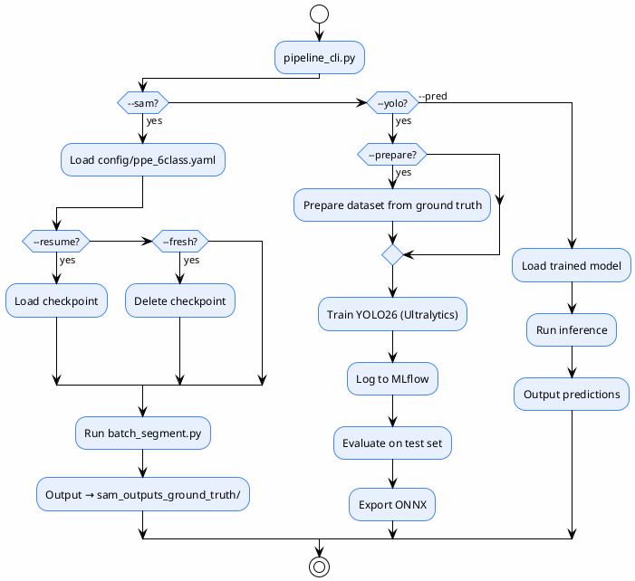

---
title: "CLI and API"
category: "Operations"
order: 14
status: "Verified"
---

# CLI and API

> วิธีเรียกใช้งาน pipeline — ครอบคลุม 3 modes (sam, yolo, pred)
>
> **Status**: Verified — สอบกับ `sam3_auto_label/src/batch_segment.py:97-107` และ `pipeline_cli.py:834-1335`
>
> **ไม่มี REST API** — `RELEASE_NOTES_v1.0.0.md` ระบุว่ามี FastAPI แต่โค้ดไม่มี

---

## CLI 1: `batch_segment.py` (SAM 3.1 — โดยตรง)

```bash
python src/batch_segment.py \
    --config config/ppe_6class.yaml \
    --threshold 0.3 \
    --resolution 1024 \
    --device cuda \
    --input /path/to/images \
    --output /path/to/output \
    --resume
```

### Arguments

| Flag | Type | Default | หน้าที่ |
|------|------|---------|---------|
| `-c`, `--config` | str | `config/ppe_6class.yaml` | YAML config path |
| `--threshold` | float | (จาก config) | override `confidence_threshold` |
| `--resolution` | int | (จาก config) | override `resolution` |
| `--device` | choice | (จาก config) | override `device` (`auto`/`cpu`/`cuda`/`rocm`/`mps`) |
| `--input` | str | (จาก config) | override `input_dir` |
| `--output` | str | (จาก config) | override `output_dir` |
| `--resume` | flag | `False` | resume จาก checkpoint |
| `--fresh` | flag | `False` | เริ่มใหม่ (ลบ checkpoint) |

> `src/batch_segment.py:97-107`

---

## CLI 2: `pipeline_cli.py` (Orchestrator — 3 modes)

### Mode: SAM (RQ1 — Auto-Label)

```bash
python pipeline_cli.py --sam --resume
python pipeline_cli.py --sam --fresh
```

### Mode: YOLO (RQ2 — Training)

```bash
python pipeline_cli.py --yolo --batch combined_v2 --stage 12 --epochs 100
python pipeline_cli.py --yolo --model yolo26n,yolo26s --prepare
```

### Mode: PRED (YOLO26 Inference)

```bash
python pipeline_cli.py --pred --model yolo26s --conf 0.25 --iou 0.45 --imgsz 640
```

### Arguments ทั้งหมด

| Flag | Type | Default | หน้าที่ |
|------|------|---------|---------|
| `-v`, `--verbose` | flag | — | เพิ่ม verbosity |
| `-q`, `--quiet` | flag | — | ลด output |
| `--debug` | flag | — | full tracebacks |
| `--dry-run` | flag | — | preview ไม่ execute |
| `--format` | choice | `table` | output format (`table`/`json`/`plain`) |
| `-V`, `--version` | flag | — | แสดง version |
| `--sam` | flag | — | mode = SAM auto-label |
| `--yolo` | flag | — | mode = YOLO26 training |
| `--pred` | flag | — | mode = YOLO26 inference |
| `--batch` | str | — | comma-separated dataset names |
| `--model` | str | — | comma-separated model keys |
| `--stage` | int | 12 | training stage (1, 2, หรือ 12) |
| `--conf` | float | 0.25 | confidence threshold (pred) |
| `--iou` | float | 0.45 | IoU NMS threshold (pred) |
| `--imgsz` | int | 640 | image size (pred) |
| `--device` | str | `"0"` | device |
| `--epochs` | int | — | override YOLO epochs |
| `--batch-size` | int | — | override YOLO batch |
| `--workers` | int | — | override workers |
| `--optimizer` | choice | — | `SGD`/`Adam`/`AdamW`/`RMSProp` |
| `--lr0` | float | — | learning rate |
| `--patience` | int | — | early-stopping patience |
| `--fresh` | flag | — | SAM fresh start |
| `--resume` | flag | — | SAM resume |
| `--prepare` | flag | — | YOLO prepare dataset |
| `--copy-tmp` | flag | — | YOLO copy datasets to `/tmp` |

> `pipeline_cli.py:834-852, 1304-1335`

---

## Mode Flow



---

## หมายเหตุ

- `pipeline_cli.py` **hard-code** config path เป็น `config/ppe_6class.yaml` — ไม่มี flag สำหรับเปลี่ยน
- โหมด `--sam` จะเรียก `batch_segment.py` ภายใต้มีด
- โหมด `--yolo` ใช้ Ultralytics CLI/API ภายใต้มีด
- โหมด `--pred` โหลดโมเดลที่เทรนแล้วจาก `yolo26_ppe/models/`
- ไม่มี REST API ในโค้ดจริง

---

## อ้างอิง

- `sam3_auto_label/src/batch_segment.py:97-107` — parse_args
- `pipeline_cli.py:834-852` — mode selection
- `pipeline_cli.py:874-902` — mode dispatch
- `pipeline_cli.py:1036-1095` — pred mode
- `pipeline_cli.py:1304-1335` — main entry
