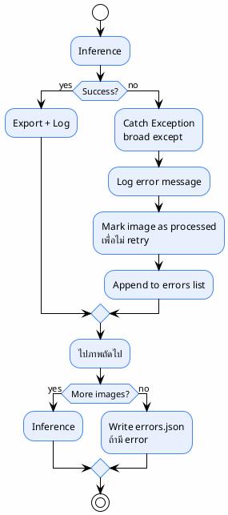

# 12 — Error Handling

> Failure mode และการจัดการ
>
> **Status**: Verified — สอบกับ `src/batch_segment.py`, `src/inference.py`, `src/tracker.py`

---

## Error Handling ที่มีจริง



### Try/Except ทั้งหมดใน `src/`

| File | Location | จับอะไร | ทำอะไร |
|------|----------|---------|--------|
| `batch_segment.py:61-66` | `load_checkpoint()` | `Exception` (broad) | log warning, return `None` |
| `batch_segment.py:282-285` | `load_image()` | `Exception` (broad) | return `None` |
| `batch_segment.py:289-295` | `export_image()` | `Exception` (broad) | log "export failed" |
| `batch_segment.py:299-302` | iterator priming | `StopIteration` | จบ loop |
| `batch_segment.py:311-392` | per-image loop | `Exception` (broad) | log, append to errors, mark processed |
| `batch_segment.py:316-320` | prefetch | `StopIteration` | หยุด prefetch |
| `inference.py:22-28` | GPU ops import | `ImportError` | `_HAS_GPU_OPS = False` |
| `inference.py:80-84` | `mask_to_rle_gpu()` | `Exception` (broad) | fallback CPU |
| `inference.py:120-131` | `masks_batch_to_rle_gpu()` | `Exception` (broad) | fallback CPU |
| `inference.py:177-186` | `_mask_iou()` | `Exception` (broad) | return `0.0` |
| `inference.py:310-312` | `cross_class_nms_gpu()` | `Exception` (broad) | fallback CPU bbox NMS |
| `tracker.py:87-96` | `_git_commit()` | `Exception` (broad) | return `"unknown"` |

---

## Failure Mode Table

| Error | Cause | Action ในโค้ด | Action ที่ควรมี |
|-------|-------|---------------|-----------------|
| Image unreadable | corrupted file | return `None`, ข้าม | ✅ พอใช้ได้ |
| No mask | SAM ไม่ detect อะไร | ไม่ error — ภาพนั้นมี 0 annotation | ✅ ปกติ |
| Inference crash | กรณี edge case | catch, log, mark processed, ข้าม | ⚠️ ไม่ retry |
| Export crash | format bug | catch, log "export failed" | ⚠️ ไม่ retry export |
| GPU OOM | image ใหญ่ + resolution สูง | **ไม่มี handling** — crash ทั้ง pipeline | ❌ ควร catch + resize/retry |
| Model timeout | inference ช้ามาก | **ไม่มี timeout** | ❌ ควรมี |
| Checkpoint corrupt | ไฟล์เสีย | catch, log warning, return `None` → เริ่มใหม่ | ✅ พอใช้ได้ |
| GPU ops ไม่พร้อม | `sam3.perflib` ไม่ import ได้ | fallback CPU | ✅ ดี |
| Git ไม่พร้อม | ไม่ใช่ git repo | return `"unknown"` | ✅ พอใช้ได้ |

---

## Error Output

ถ้ามีภาพที่ error ระบบจะเขียน `errors.json` ที่ output dir:

```json
{
  "total_errors": 3,
  "errors": [
    {"image": "IMG_001.jpg", "error": "RuntimeError: ..."},
    {"image": "IMG_045.png", "error": "PIL.UnidentifiedImageError: ..."},
    {"image": "IMG_102.jpg", "error": "torch.cuda.OutOfMemoryError: ..."}
  ]
}
```

> `src/batch_segment.py` — `errors` list ถูก append ใน per-image loop

---

## สิ่งที่ระบบทั่วไปมักมี (แต่โค้ดนี้ไม่มี)

### ❌ Retry Logic

แนวทางทั่วไป:
```
Inference → Failure → Retry → Success/Failed → QC/Error Queue
```

**โค้ดจริง**: ไม่มี retry — ภาพที่ fail จะถูก mark ว่า processed และข้ามไปทันที

```python
# src/batch_segment.py:389-390 (สรุป)
# mark as processed so we don't retry forever
processed.add(img_path)
```

### ❌ GPU OOM Handling

แนวทางทั่วไป: catch OOM → resize image → retry

**โค้ดจริง**: ไม่มี `torch.cuda.OutOfMemoryError` catch — ถ้า OOM ทั้ง pipeline crash

### ❌ Model Timeout

แนวทางทั่วไป: ถ้า inference ช้าเกินไป → timeout → retry

**โค้ดจริง**: ไม่มี timeout mechanism

### ❌ Error Queue

แนวทางทั่วไป: error ไป queue สำหรับตรวจสอบทีหลัง

**โค้ดจริง**: error ไปอยู่ใน `errors.json` และ `experiments.db` (count) — ไม่มี queue สำหรับ reprocess

---

## ความเสี่ยงด้าน Error Handling

| ความเสี่ยง | ระดับ | หมายเหตุ |
|-----------|-------|---------|
| OOM ทำ pipeline crash หลายชั่วโมง | สูง | ไม่มี recovery — ต้องเริ่มใหม่ (มี checkpoint ช่วยได้) |
| Broad except ซ่อน bug | กลาง | catch `Exception` ทุกอย่าง → อาจกลืน error สำคัญ |
| ไม่ retry ภาพที่ fail | กลาง | ถ้า error เป็น transient (เช่น GPU ไม่พร้อมชั่วคราว) จะเสียภาพนั้น |
| ไม่มี alerting | สูง | ไม่มี notification เมื่อ error rate สูง |

---

## อ้างอิง

- `src/batch_segment.py:311-392` — per-image error handling
- `src/batch_segment.py:282-285` — load_image error
- `src/inference.py:22-28` — GPU ops fallback
- `src/inference.py:80-84` — RLE fallback
- `src/tracker.py:87-96` — git commit fallback
