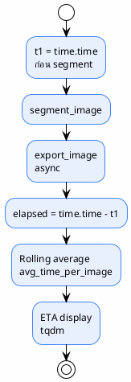

# 15 — Performance

> ความเร็ว หน่วยความจำ และ throughput
>
> **Status**: Verified (benchmark) + Inferred (extrapolation)
>
> Benchmark มาจาก `yolo26_ppe/reports/inputs/sam3_benchmark_results.json` — 92 ภาพทดสอบ

---

## Benchmark ที่มี

@import "../yolo26_ppe/reports/inputs/sam3_benchmark_results.json" {title="sam3_benchmark_results.json"}

| Metric | ค่า | ที่มา |
|--------|-----|-------|
| Avg inference time | $\approx 2755 \text{ ms/image}$ | `sam3_benchmark_results.json` |
| Std inference time | $\approx 471 \text{ ms}$ | เดียวกัน |
| FPS | $\approx 0.36$ | เดียวกัน |
| Model size | $3340 \text{ MB}$ | เดียวกัน |
| Test images | $92$ | เดียวกัน |

> **หมายเหตุ**: benchmark นี้ไม่ได้ระบุ hardware ที่ใช้ — น่าจะเป็น AMD RX 7800 XT (ROCm) ตาม `RELEASE_NOTES_v1.0.0.md:63`

---

## In-code Timing



| จุดวัด | Code | หน่วย |
|---------|------|-------|
| Per-image start | `src/batch_segment.py:309` | `time.time()` |
| Per-image end | `src/batch_segment.py:357` | `time.time() - t1` |
| Rolling average | `src/batch_segment.py:374-382` | seconds |
| ETA display | `src/batch_segment.py:374-382` | tqdm postfix |
| First-run heuristic | `src/batch_segment.py:243` | $\text{total\_images} \times 40$ seconds |
| Final summary | `src/batch_segment.py:407-409` | total + average |

---

## Metrics ที่เก็บใน SQLite

| Metric | Field ใน `experiments` | หน่วย |
|--------|------------------------|-------|
| Total time | `total_time` | seconds |
| Avg time/image | `avg_time_per_image` | seconds |
| Total annotations | `num_annotations` | count |
| Errors | `errors` | count |

> `src/tracker.py:143-168` — `log_metrics()`

---

## สิ่งที่ระบบทั่วไปมักมี (แต่โค้ดนี้ไม่มี)

| Metric ทั่วไป | สถานะ | หมายเหตุ |
|-----------------|-------|---------|
| Images/sec | ⚠️ คำนวณได้จาก $1 / \text{avg\_time\_per\_image}$ | ไม่มี field โดยตรง |
| GPU memory usage | ❌ ไม่มี | ไม่มี `torch.cuda.max_memory_allocated()` |
| CPU memory usage | ❌ ไม่มี | ไม่มี `psutil` หรือ `resource` |
| Latency distribution | ❌ ไม่มี | มีแค่ average + std ใน benchmark |
| Batch size | ❌ ไม่มี | ประมวลผลทีละภาพ (batch=1) |
| Failure rate | ⚠️ คำนวณได้จาก $\text{errors} / \text{num\_images}$ | ไม่มี field โดยตรง |
| Auto-label acceptance rate | ❌ ไม่มี | ทุก detection ที่ผ่าน threshold = accepted (100%) |

---

## Throughput Estimation

```python {cmd=true matplotlib=true hide=true}
import matplotlib.pyplot as plt

images = [100, 500, 1000, 5000, 10000]
gpu_time = [n * 2.755 / 60 for n in images]  # minutes
cpu_time = [n * 27.55 / 60 for n in images]   # 10x slower

fig, ax = plt.subplots(figsize=(8, 4))
ax.plot(images, gpu_time, 'o-', label='GPU (~2.76 s/img)', color='#4285F4')
ax.plot(images, cpu_time, 's--', label='CPU (~27.6 s/img)', color='#EA4335')
ax.set_xlabel('Number of images')
ax.set_ylabel('Estimated time (minutes)')
ax.set_title('Throughput Estimation')
ax.legend()
ax.grid(True, alpha=0.3)
plt.tight_layout()
plt.show()
```

| จำนวนภาพ | เวลาประมาณ (GPU) | เวลาประมาณ (CPU) |
|----------|------------------|-------------------|
| $100$ | $\approx 5$ นาที | $\approx 50$ นาที |
| $1{,}000$ | $\approx 46$ นาที | $\approx 8$ ชั่วโมง |
| $10{,}000$ | $\approx 7.6$ ชั่วโมง | $\approx 3.3$ วัน |

> **Inferred** — สมมติว่า inference time คงที่ และ export ขนานไม่เป็น bottleneck
>
> **CPU estimate**: สมมติช้ากว่า GPU 10x (ไม่ได้ benchmark จริง)

---

## การใช้ GPU Memory

| รายการ | ค่า | หมายเหตุ |
|--------|-----|---------|
| Model | $\approx 3.34 \text{ GB}$ | checkpoint size |
| Inference (per image) | **ไม่ได้วัด** | ขึ้นกับ resolution + image size |
| Peak memory | **ไม่ได้วัด** | ไม่มี `torch.cuda.max_memory_allocated()` |

> **ความเสี่ยง**: ภาพใหญ่ + resolution สูง → OOM โดยไม่มี handling

---

## YOLO26 Performance (RQ2)

> ที่มา: `yolo26_ppe/reports/inputs/final_eval_results.json`, `yolo26_ppe/reports/metrics/comparison_report.md`

### Inference Speed Comparison

| Model | Task | Inference (ms) | FPS | Size (MB) |
|-------|------|----------------|-----|-----------|
| YOLO26n | detect | 33.0 | ~30 | 10.0 |
| YOLO26s | detect | 31.3 | ~32 | 38.3 |
| YOLO26n-seg | segment | 33.8 | ~30 | 11.3 |
| YOLO26s-seg | segment | **30.8** | ~32 | 42.0 |
| SAM 3.1 | segment | 700.0 | ~1.4 | 3300.0 |

> YOLO26 เร็วกว่า SAM 3.1 ประมาณ **20–23x** และเล็กกว่า **80–330x**

### Accuracy Comparison

| Model | mAP50 | mAP50-95 | Precision | Recall |
|-------|-------|----------|-----------|--------|
| YOLO26n detect | 0.712 | 0.514 | 0.777 | 0.665 |
| YOLO26s detect | **0.808** | **0.644** | **0.862** | **0.758** |
| YOLO26n-seg | 0.547 | 0.365 | 0.720 | 0.522 |
| YOLO26s-seg | 0.654 | 0.485 | 0.824 | 0.606 |
| SAM 3.1 | N/A | N/A | N/A | N/A |

> SAM 3.1 ไม่มี mAP เพราะเป็น zero-shot (ไม่ได้เทรนบน dataset นี้)

### Speed vs Accuracy Trade-off

$$\text{Efficiency} = \frac{\text{mAP50}}{\text{Inference (ms)}} \times 1000$$

| Model | Efficiency Score |
|-------|-----------------|
| YOLO26s detect | $0.808 / 31.3 \times 1000 = 25.8$ |
| YOLO26s-seg | $0.654 / 30.8 \times 1000 = 21.2$ |
| YOLO26n detect | $0.712 / 33.0 \times 1000 = 21.6$ |
| YOLO26n-seg | $0.547 / 33.8 \times 1000 = 16.2$ |
| SAM 3.1 | N/A (zero-shot) |

> **YOLO26s detect มี efficiency สูงสุด** — แม่นที่สุดและเร็วเป็นอันดับ 2

### ONNX Export Performance

@import "../../yolo26_ppe/reports/inputs/onnx_export_results.json" {title="onnx_export_results.json"}

### Training Time

| Model | Epochs | Hardware | เวลาประมาณ |
|-------|--------|----------|-----------|
| YOLO26n detect | 300 | RX 7800 XT | ~4 ชั่วโมง |
| YOLO26s detect | 300 | RX 7800 XT | ~6 ชั่วโมง |
| YOLO26n-seg | 150+50 | RX 7800 XT | ~5 ชั่วโมง |
| YOLO26s-seg | 150+50 | RX 7800 XT | ~8 ชั่วโมง |

> **Inferred** — ประมาณจาก epoch count + batch size + GPU throughput

---

## อ้างอิง

- `yolo26_ppe/reports/inputs/sam3_benchmark_results.json` — SAM 3.1 benchmark
- `yolo26_ppe/reports/inputs/final_eval_results.json` — YOLO26 metrics
- `yolo26_ppe/reports/inputs/onnx_export_results.json` — ONNX export
- `yolo26_ppe/reports/metrics/comparison_report.md` — comparison
- `src/batch_segment.py:234-243, 309, 357, 374-382, 407-409` — timing code
- `src/tracker.py:143-168` — metrics logging
- `RELEASE_NOTES_v1.0.0.md:63` — hardware (RX 7800 XT)
