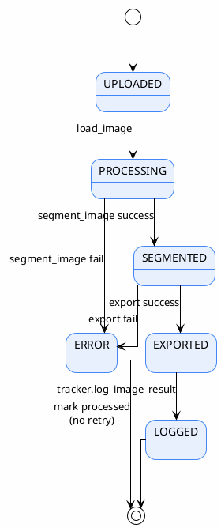

# 03 — Pipeline Flow

> Step-by-step workflow — how data flows through the system
>
> **Status**: Verified — checked against `src/batch_segment.py:main()` lines 130-435

---

## Main Flowchart

---

## Steps That Typical Systems Usually Have (but this code does not)

| Typical step | Status | Note |
|---------------|-------|---------|
| Validate image (corrupted check) | ⚠️ Partial | `load_image()` catches exception → returns `None` but no proactive validation |
| Filter small objects (min area) | ❌ Missing | no `min_area` filter — only drops tiny components <3px during polygon tracing |
| Classify region | ❌ Missing | SAM 3.1 provides class from text prompt directly |
| Calculate confidence (composite score) | ❌ Missing | uses raw model score, no weighted formula |
| Human review branch | ❌ Missing | every detection that passes threshold → annotation immediately |
| Retry on failure | ❌ Missing | mark processed and skip |

---

## References

- `src/batch_segment.py:130-435` — `main()` entire function
- `src/inference.py:382-520` — `segment_image()`
- `src/exporters.py:608-623` — `write_image_exports()`, `finalize_exports()`
