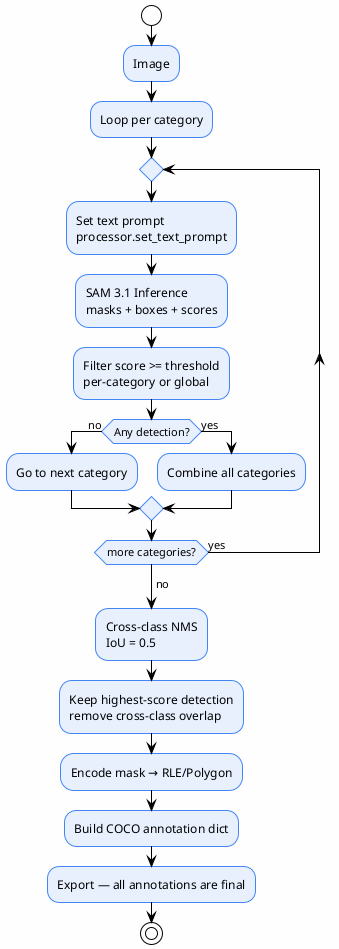

# 08 — Auto-Labeling Strategy

> How the system decides to create labels — the core of the project
>
> **Status**: Verified — checked against `src/inference.py:382-520`

---

## Actual Strategy in Code



> **Important**: no auto-accept/review/reject tiers — every detection that passes threshold + NMS immediately becomes a final annotation

---

## Decision Logic Step by Step

### 1. Text Prompt (no point/box prompt)

@import "../../sam3_auto_label/src/inference.py" {line_begin=404 line_end=406 title="inference.py:404-406 — text prompt loop"}

| Prompt Type | Status |
|-------------|-------|
| Text prompt | ✅ Used (e.g., `"person"`, `"helmet"`) |
| Point prompt | ❌ Not present |
| Box prompt | ❌ Not present |
| Negative prompt | ❌ Not present |

### 2. Confidence Threshold (per-category override)

@import "../../sam3_auto_label/src/inference.py" {line_begin=416 line_end=416 title="inference.py:416 — threshold logic"}

$$
T_{\text{cat}} = \begin{cases} T_{\text{global}} & \text{if } T_{\text{cat}} < 0 \\ T_{\text{cat}} & \text{otherwise} \end{cases}
$$

| Category | Threshold | Note |
|----------|-----------|---------|
| `person` | $0.7$ | High because person is clearly visible |
| `helmet` | $0.25$ | Low because object is small |
| `boots` | $0.25$ | Low |
| `shoes` | $0.25$ | Low |
| `sandals` | $0.3$ | Medium |
| `harness` | $0.25$ | Low because rare |
| Global fallback | $0.25$ | Used when `cat.threshold = -1` |

### 3. Cross-class NMS

@import "../../sam3_auto_label/src/inference.py" {line_begin=470 line_end=474 title="inference.py:470-474 — NMS call"}

| Parameter | Value | Note |
|-------------|-----|---------|
| `iou_threshold` | $0.5$ | if $\text{IoU} \geq 0.5$ between 2 cross-class detections → keep higher score |
| Within-class | handled by SAM 3.1 itself | no separate within-class NMS in code |

### 4. Result = Final Annotation

```json
{
  "id": 1,
  "image_id": 1,
  "category_id": 2,
  "bbox": [120.5, 45.0, 80.0, 60.0],
  "area": 4800.0,
  "score": 0.87,
  "segmentation": {"size": [720, 1280], "counts": "RLE_encoded_string..."}
}
```

→ No subsequent "review" or "validate" step — this annotation is final

---

## What Typical Systems Usually Have (but this code does not)

### ❌ Composite Confidence Score

Typical approach:
$$
\text{Final Score} = w_1 \cdot \text{ClassificationConf} + w_2 \cdot \text{MaskQuality} + w_3 \cdot \text{AreaValidity} + w_4 \cdot \text{ModelAgreement}
$$

**Actual code**: uses raw `score` from SAM 3.1 alone — no weighted formula, no mask quality metric, no area validity, no model agreement

### ❌ Auto-accept / Review / Reject Tiers

Typical approach:

| Score | Action |
|-------|--------|
| $> 0.90$ | Auto Accept |
| $0.70$–$0.90$ | Review |
| $< 0.70$ | Reject |

**Actual code**: only a single threshold — pass = annotation, fail = discarded, no "review" tier

### ❌ Multi-Model Agreement

Typical approach:
```
Image → SAM 3.1 + YOLO → Agreement Check → Final Label
```

**Actual code**: SAM 3.1 only — YOLO26 is in the next pipeline stage (training), not used to confirm labels during auto-labeling

### ❌ Mask Quality Gate

Typical approach: check mask quality before confirming

**Actual code**: none — every mask that passes threshold + NMS is exported without additional quality checks

---

## Risks of Current Strategy

| Risk | Level | Note |
|-----------|-------|---------|
| False positive contamination | High | low threshold (0.25) + no review → noise enters dataset |
| Overlap between boots/shoes/sandals | Medium | NMS helps somewhat, but if $\text{IoU} < 0.5$ both are kept |
| Unknown label reliability | High | no separate quality score — only raw model score |
| Changing prompt changes labels | Medium | no prompt versioning — must check config_json in experiments.db |

---

## References

- `src/inference.py:404-406` — text prompt loop
- `src/inference.py:416` — per-category threshold
- `src/inference.py:470-474` — cross-class NMS
- `src/inference.py:491-520` — annotation construction
- `config/ppe_6class.yaml` — thresholds
