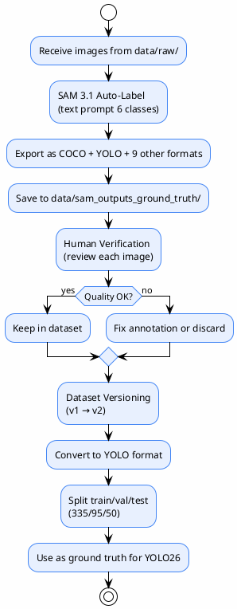
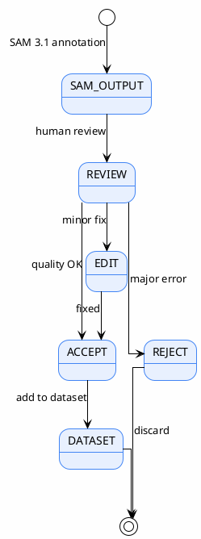
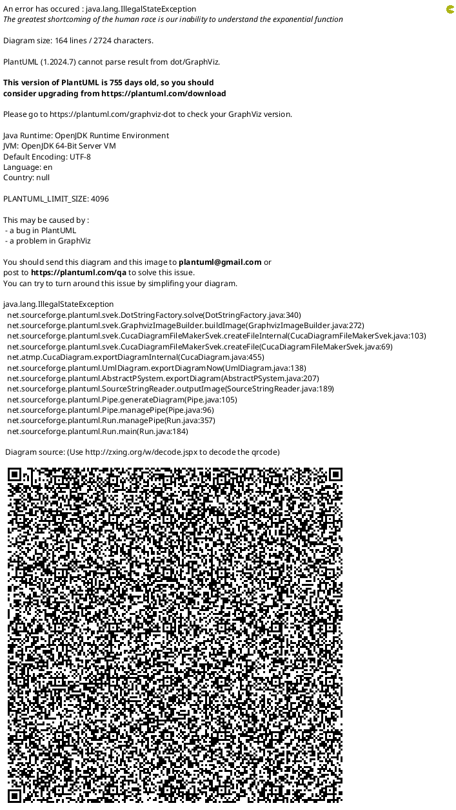

# Ground Truth Generation (Requirement 3)

> Generate a ground truth dataset from submitted images using SAM 3.1 auto-labeling + human verification
>
> **Status**: Verified — checked against `data/sam_outputs_ground_truth/`, `yolo26_ppe/data/`, `yolo26_ppe/reports/source/report.tex:430-627`

---

## Objective

Create a PPE dataset with complete annotations (bounding box + segmentation mask) for:
1. Ground truth for evaluating YOLO26
2. Training data for YOLO26
3. A dataset to deliver to the company / for further use

---

## Ground Truth Pipeline



---

## Output Location

```
data/sam_outputs_ground_truth/
├── blurred/                    ← blurred images (robustness test)
├── coco/                       ← COCO JSON (per-image + combined)
│   ├── annotations.json        ← combined annotations
│   └── {image_name}.json       ← per-image cache
├── custom_capture_2026-08-14/  ← specific batch
├── flip_flops/                 ← specific batch
├── single_test/                ← specific batch
├── two_test/                   ← specific batch
├── viz/                        ← visualization overlay
├── experiments.db              ← SQLite experiment log
└── checkpoint.json             ← resume checkpoint
```

> Source: `data/sam_outputs_ground_truth/` directory listing

---

## Annotation Procedure

> Source: `yolo26_ppe/reports/source/report.tex:463-475`

1. **Input**: raw images from `data/raw/` (multiple batches: `blurred`, `custom_capture_2026-08-14`, `flip_flops`, `single_test`, `two_test`)
2. **SAM 3.1 inference**: text prompt per class (person, helmet, boots, shoes, sandals, harness)
3. **Filtering**: confidence threshold (per-class) + cross-class NMS (IoU=0.5)
4. **Export**: COCO JSON + YOLO TXT + other formats per config
5. **Visualization**: overlay mask + box + label + score on every image

---

## Human Verification Protocol

> Source: `yolo26_ppe/reports/source/report.tex:476-485`



> **Note**: this is manual review, not an automated queue system

---

## Dataset Versions

### Version 1 (v1)

- `yolo_detection_dataset_version_1/`
- `yolo_segmentation_dataset_version_1/`
- Used for the first training round

### Version 2 (v2)

- `yolo_detection_dataset_version_2/`
- `yolo_segmentation_dataset_version_2/`
- `combined_coco_dataset_version_2/`
- Improved split + class balancing

> Source: `yolo26_ppe/data/` directory listing

---

## RQ1 Evaluation Metrics

> Source: `yolo26_ppe/reports/source/report.tex:486-506`

| Metric | Description |
|--------|---------|
| Annotation time per image | Time SAM 3.1 takes per image |
| Annotations per image | Average number of detections |
| Human verification rate | % that passed without edits |
| Coverage | % of images with at least 1 annotated class |

---

## Annotation Efficiency

> Source: `yolo26_ppe/reports/source/report.tex:507-530`



> SAM 3.1 is ~100x faster than manual annotation — even including human verification time, it is still much faster

---

## SAM 3.1 Optimization

> Source: `yolo26_ppe/reports/source/report.tex:531-558`

| Optimization | Status | Result |
|-------------|-------|-----|
| GPU ops (RLE encode + mask IoU) | ✅ | ~30% faster |
| Pipeline export (async) | ✅ | GPU utilization ~100% |
| No-viz mode | ✅ | Can skip visualization |

---

## References

- `yolo26_ppe/reports/source/report.tex:430-627` — RQ1 chapter (ground truth)
- `yolo26_ppe/reports/source/report.tex:476-485` — human verification protocol
- `data/sam_outputs_ground_truth/` — output directory
- `yolo26_ppe/data/` — dataset versions
- `sam3_auto_label/src/batch_segment.py` — auto-labeling code
- `sam3_auto_label/config/ppe_6class.yaml` — 6 classes + thresholds
