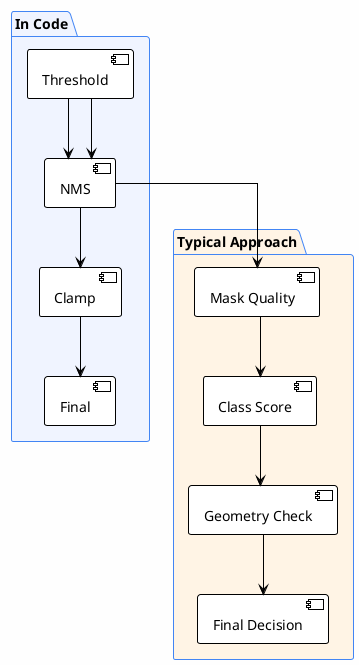
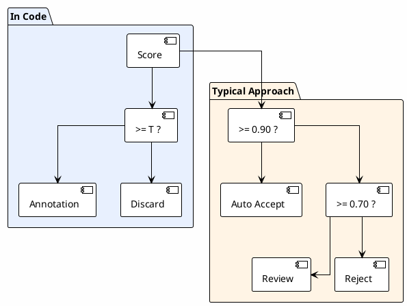

# 09 — Quality Control

> How does the system know the auto-labels it generates are correct?
>
> **Status**: Verified — checked against `src/inference.py`, `src/exporters.py`

---

## Actual QC in Code



> The actual system has far less QC than the typical approach — relies primarily on threshold + NMS

---

## Quality Risks

| Risk | Level | Mitigating mechanism | What is missing |
|-----------|-------|-------------|-----------|
| Mask too large (covers entire image) | High | — | No `max_area_ratio` filter |
| Mask too small (1-2 px) | Medium | tiny component drop (< 3px) | No configurable `min_area` filter |
| Malformed polygon | Medium | Douglas-Peucker | No self-intersection check |
| False positive from low threshold | High | — | No review tier |
| Overlap between similar classes | Medium | NMS $\text{IoU}=0.5$ | if $\text{IoU} < 0.5$ both are kept |

---

## References

- `src/inference.py:416-425` — threshold
- `src/inference.py:189-313` — NMS
- `src/inference.py:140-145` — clamp_box
- `src/exporters.py:87-116` — Douglas-Peucker
- `src/exporters.py:147-149` — tiny component drop

---


# 10 — Confidence Scoring

> How the system calculates confidence scores and what it uses them for
>
> **Status**: Verified — checked against `src/inference.py:382-520`

---

## Actual Confidence Score in Code

### Source

Score comes **directly from SAM 3.1** — it is model output, not additionally computed

```python
# src/inference.py (summary from segment_image)
output = processor.set_text_prompt(state=inference_state, prompt=cat.prompt)
masks, boxes, scores = output.masks, output.boxes, output.scores
# scores is a float tensor [N] with values 0.0–1.0
```

### Usage



---

## Actual Threshold Values Used

| Category | Threshold | Level | Note |
|----------|-----------|-------|---------|
| `person` | $0.7$ | High | large object, clearly visible → set high to reduce false positives |
| `helmet` | $0.25$ | Low | small object → set low to avoid missing |
| `boots` | $0.25$ | Low | same |
| `shoes` | $0.25$ | Low | same |
| `sandals` | $0.3$ | Medium | relatively rare |
| `harness` | $0.25$ | Low | rare + complex appearance |
| Global | $0.25$ | Low | fallback |

> **Observation**: most thresholds are at $0.25$ — quite low → may allow false positives into the dataset

---

## References

- `src/inference.py:404-406` — inference call
- `src/inference.py:416` — threshold logic
- `src/inference.py:421` — filter
- `src/inference.py:512` — score in annotation
- `config/ppe_6class.yaml` — threshold values
