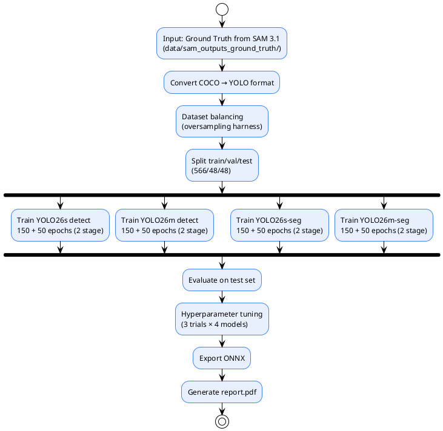
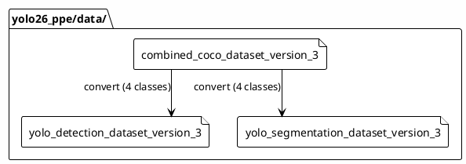

# YOLO26 Training (Requirement 2)

> Train 4 YOLO26 models to compare the accuracy–efficiency trade-off for PPE detection
>
> **Status**: Verified — checked against `yolo26_ppe/`, `yolo26_ppe/reports/final/report.pdf`, `yolo26_ppe/configs/`

---

## Objective

Compare the performance and computational efficiency of 4 YOLO26 models (v3 dataset, 4 classes):

| Model | Task | Scale |
|-------|------|-------|
| YOLO26s | Detection | Small |
| YOLO26m | Detection | Medium |
| YOLO26s-seg | Segmentation | Small |
| YOLO26m-seg | Segmentation | Medium |

> Source: `yolo26_ppe/reports/source/report.tex`, `yolo26_ppe/models/production/`

---

## Training Pipeline

---

## Training Configuration

| Parameter | Value |
|-----------|-------|
| Epochs | 150 (stage 1) + 50 (stage 2) for all models |
| Batch size | 6 (all models, AMP enabled) |
| Image size | 640 px (eval at 960 with TTA) |
| Optimizer | SGD (stage 1), AdamW (stage 2) |
| Learning rate (lr0) | 0.01 (stage 1), 0.001 (stage 2) |
| Final LR factor (lrf) | 0.01 (cosine decay) |
| Momentum | 0.937 |
| Weight decay | 0.0005 |
| Warmup epochs | 3 |
| Patience | 30 (stage 1), 15 (stage 2) |
| Freeze | 10 (stage 1 backbone frozen), 0 (stage 2) |
| Hardware | AMD RX 7800 XT (ROCm, WSL2) |
| Random seed | 42 |

> Source: `yolo26_ppe/scripts/pipeline/02_train_models.py`, `yolo26_ppe/configs/production_train.yaml`
>
> Note: `medium_segmentation` stage 1 early-stopped at epoch 117 (best epoch 96) — normal early-stopping, not a failure.

---

## Dataset (v3, 4 classes)

### Size

| Split | Image count |
|-------|---------|
| Train | 566 |
| Validation | 48 |
| Test | 48 |
| **Total** | **662** |

> Source: `yolo26_ppe/reports/final/report.pdf`, `yolo26_ppe/data/yolo_detection_dataset_version_3/`

### Class Distribution (annotations)

| Class | Count | Status |
|-------|-------|-------|
| person | 2267 | Adequate |
| helmet | 2503 | Adequate |
| closed footwear | 3350 | Adequate |
| harness | 177 | Underrepresented (19:1 imbalance) |

### Class Balancing

- **Oversampling target**: harness → 500 annotations via image duplication (cap 10x)
- **Focal Loss**: `focal_patch.py` monkey-patches `v8DetectionLoss.bce` (gamma=1.5, alpha=0.25)

> Source: `yolo26_ppe/scripts/pipeline/01_prepare_dataset.py`, `yolo26_ppe/reports/metrics/comparison_report.md`

---

## Dataset Versions

> Source: `yolo26_ppe/data/` directory listing

---

## MLflow Integration

YOLO26 training uses **MLflow** for experiment tracking (unlike SAM 3.1 which uses SQLite):

@import "../../yolo26_ppe/configs/mlflow.yaml" {title="mlflow.yaml"}

> MLflow tracking URI and configuration are in `yolo26_ppe/configs/mlflow.yaml`

---

## Training Config

@import "../../yolo26_ppe/configs/production_train.yaml" {title="production_train.yaml"}

---

## Augmentation Config

@import "../../yolo26_ppe/configs/production_augmentation.yaml" {title="production_augmentation.yaml"}

---

## Hyperparameter Tuning (v2 cohort — historical)

| Model | Baseline mAP50 | Best Trial mAP50 | Improved? |
|-------|---------------|-----------------|-----------|
| n_detect | 0.4623 | 0.3950 | ❌ No |
| s_detect | 0.5551 | 0.4937 | ❌ No |
| n_seg | 0.4158 | 0.3822 | ❌ No |
| s_seg | 0.5538 | 0.4753 | ❌ No |

> **Summary**: 50-epoch tuning trials could not match the 150-epoch baseline — all baseline weights were retained. These results are from the archived v2 5-class cohort; the current v3 models were trained with the fixed two-stage recipe above.
>
> Source: `yolo26_ppe/reports/metrics/` (tune_*.json)

### Tuned Parameters

- `lr0`, `imgsz`, `cls_pw`, `mosaic`, `mixup`, `copy_paste`, `scale`, `close_mosaic`

---

## References

- `yolo26_ppe/reports/final/report.pdf` — full report
- `yolo26_ppe/reports/source/report.tex:628-747` — RQ2 chapter
- `yolo26_ppe/reports/inputs/final_eval_results.json` — metrics
- `yolo26_ppe/reports/metrics/comparison_report.md` — comparison summary
- `yolo26_ppe/configs/production_train.yaml` — training config
- `yolo26_ppe/configs/production_augmentation.yaml` — augmentation config
- `yolo26_ppe/configs/mlflow.yaml` — MLflow config
