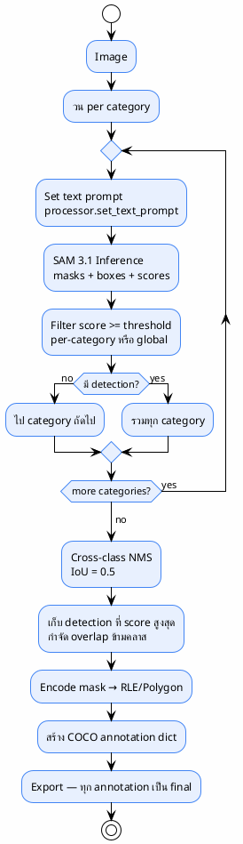

# 08 — Auto-Labeling Strategy

> ระบบตัดสินใจสร้าง label ยังไง — หัวใจของโปรเจกต์
>
> **Status**: Verified — สอบกับ `src/inference.py:382-520`

---

## Strategy จริงในโค้ด



> **สำคัญ**: ไม่มี auto-accept/review/reject tiers — ทุก detection ที่ผ่าน threshold + NMS จะกลายเป็น annotation สุดท้ายทันที

---

## Decision Logic ทีละขั้น

### 1. Text Prompt (ไม่มี point/box prompt)

@import "../../sam3_auto_label/src/inference.py" {line_begin=404 line_end=406 title="inference.py:404-406 — text prompt loop"}

| Prompt Type | สถานะ |
|-------------|-------|
| Text prompt | ✅ ใช้ (เช่น `"person"`, `"helmet"`) |
| Point prompt | ❌ ไม่มี |
| Box prompt | ❌ ไม่มี |
| Negative prompt | ❌ ไม่มี |

### 2. Confidence Threshold (per-category override)

@import "../../sam3_auto_label/src/inference.py" {line_begin=416 line_end=416 title="inference.py:416 — threshold logic"}

$$
T_{\text{cat}} = \begin{cases} T_{\text{global}} & \text{if } T_{\text{cat}} < 0 \\ T_{\text{cat}} & \text{otherwise} \end{cases}
$$

| Category | Threshold | หมายเหตุ |
|----------|-----------|---------|
| `person` | $0.7$ | สูงเพราะ person ชัดเจน |
| `helmet` | $0.25$ | ต่ำเพราะ object เล็ก |
| `boots` | $0.25$ | ต่ำ |
| `shoes` | $0.25$ | ต่ำ |
| `sandals` | $0.3$ | กลาง |
| `harness` | $0.25$ | ต่ำเพราะหายาก |
| Global fallback | $0.25$ | ใช้เมื่อ `cat.threshold = -1` |

### 3. Cross-class NMS

@import "../../sam3_auto_label/src/inference.py" {line_begin=470 line_end=474 title="inference.py:470-474 — NMS call"}

| พารามิเตอร์ | ค่า | หมายเหตุ |
|-------------|-----|---------|
| `iou_threshold` | $0.5$ | ถ้า $\text{IoU} \geq 0.5$ ระหว่าง 2 detection ข้ามคลาส → เก็บ score สูงกว่า |
| ภายในคลาส | จัดการโดย SAM 3.1 เอง | ไม่มี within-class NMS แยกในโค้ด |

### 4. ผลลัพธ์ = Final Annotation

```json
{
  "id": 1,
  "image_id": 1,
  "category_id": 2,
  "bbox": [120.5, 45.0, 80.0, 60.0],
  "area": 4800.0,
  "score": 0.87,
  "segmentation": {"size": [720, 1280], "counts": "RLE_encoded_string..."}
}
```

→ ไม่มีขั้นตอน "review" หรือ "validate" ถัดไป — annotation นี้คือ final

---

## สิ่งที่ระบบทั่วไปมักมี (แต่โค้ดนี้ไม่มี)

### ❌ Composite Confidence Score

แนวทางทั่วไป:
$$
\text{Final Score} = w_1 \cdot \text{ClassificationConf} + w_2 \cdot \text{MaskQuality} + w_3 \cdot \text{AreaValidity} + w_4 \cdot \text{ModelAgreement}
$$

**โค้ดจริง**: ใช้ `score` ดิบจาก SAM 3.1 อย่างเดียว — ไม่มี weighted formula ไม่มี mask quality metric ไม่มี area validity ไม่มี model agreement

### ❌ Auto-accept / Review / Reject Tiers

แนวทางทั่วไป:

| Score | Action |
|-------|--------|
| $> 0.90$ | Auto Accept |
| $0.70$–$0.90$ | Review |
| $< 0.70$ | Reject |

**โค้ดจริง**: มีแค่ threshold เดียว — ผ่าน = annotation, ไม่ผ่าน = หายไป ไม่มี "review" tier

### ❌ Multi-Model Agreement

แนวทางทั่วไป:
```
Image → SAM 3.1 + YOLO → Agreement Check → Final Label
```

**โค้ดจริง**: SAM 3.1 ตัวเดียว — YOLO26 อยู่ใน pipeline ถัดไป (training) ไม่ได้ใช้ยืนยัน label ตอน auto-label

### ❌ Mask Quality Gate

แนวทางทั่วไป: ตรวจ mask quality ก่อนยืนยัน

**โค้ดจริง**: ไม่มี — ทุก mask ที่ผ่าน threshold + NMS จะถูก export โดยไม่ตรวจคุณภาพเพิ่ม

---

## ความเสี่ยงของ strategy ปัจจุบัน

| ความเสี่ยง | ระดับ | หมายเหตุ |
|-----------|-------|---------|
| False positive ปน | สูง | threshold ต่ำ (0.25) + ไม่มี review → noise เข้า dataset |
| Overlap ระหว่าง boots/shoes/sandals | กลาง | NMS ช่วยได้บ้าง แต่ถ้า $\text{IoU} < 0.5$ จะเก็บทั้งคู่ |
| ไม่รู้ว่า label ไหนน่าเชื่อถือ | สูง | ไม่มี quality score แยก — มีแค่ raw model score |
| เปลี่ยน prompt แล้ว label เปลี่ยน | กลาง | ไม่มี prompt versioning — ต้องดู config_json ใน experiments.db |

---

## อ้างอิง

- `src/inference.py:404-406` — text prompt loop
- `src/inference.py:416` — per-category threshold
- `src/inference.py:470-474` — cross-class NMS
- `src/inference.py:491-520` — annotation construction
- `config/ppe_6class.yaml` — thresholds
