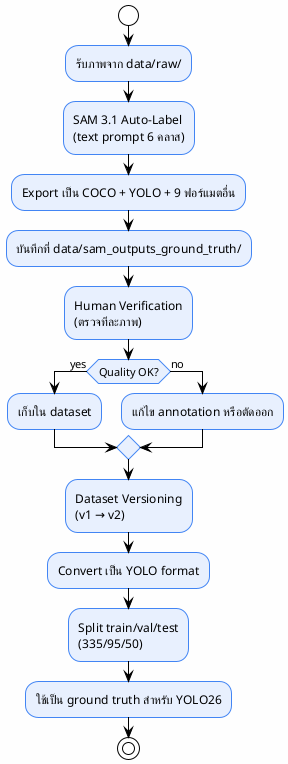
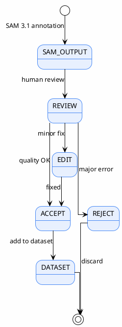
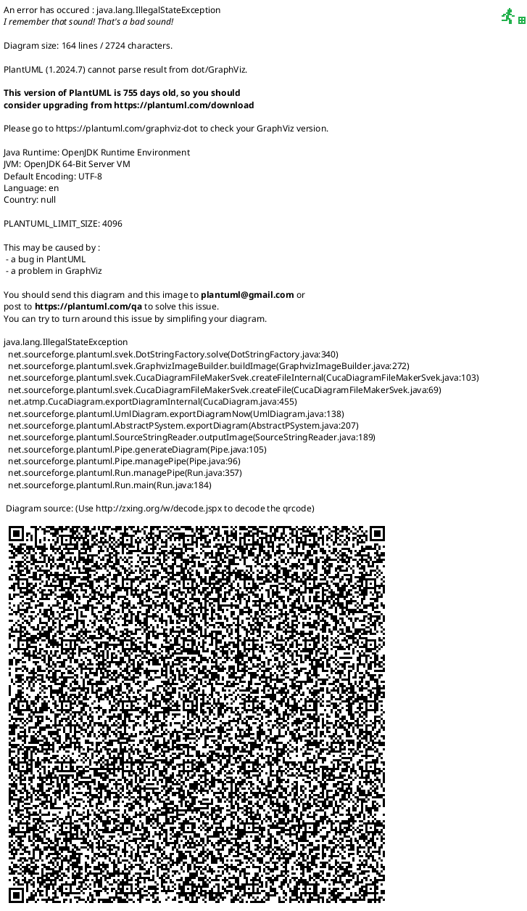

# Ground Truth Generation (Requirement 3)

> สร้าง ground truth dataset จากภาพที่ส่งไปให้ โดยใช้ SAM 3.1 auto-labeling + human verification
>
> **Status**: Verified — สอบกับ `data/sam_outputs_ground_truth/`, `yolo26_ppe/data/`, `yolo26_ppe/reports/source/report.tex:430-627`

---

## Objective

สร้างชุดข้อมูล PPE ที่มี annotation ครบถ้วน (bounding box + segmentation mask) สำหรับ:
1. เป็น ground truth สำหรับ evaluate YOLO26
2. เป็น training data สำหรับ YOLO26
3. เป็น dataset ที่ส่งให้บริษัท/ใช้งานต่อ

---

## Ground Truth Pipeline



---

## Output Location

```
data/sam_outputs_ground_truth/
├── blurred/                    ← ภาพ blur (robustness test)
├── coco/                       ← COCO JSON (per-image + combined)
│   ├── annotations.json        ← combined annotations
│   └── {image_name}.json       ← per-image cache
├── custom_capture_2026-08-14/  ← batch เฉพาะ
├── flip_flops/                 ← batch เฉพาะ
├── single_test/                ← batch เฉพาะ
├── two_test/                   ← batch เฉพาะ
├── viz/                        ← visualization overlay
├── experiments.db              ← SQLite experiment log
└── checkpoint.json             ← resume checkpoint
```

> ที่มา: `data/sam_outputs_ground_truth/` directory listing

---

## Annotation Procedure

> ที่มา: `yolo26_ppe/reports/source/report.tex:463-475`

1. **Input**: ภาพดิบจาก `data/raw/` (หลาย batch: `blurred`, `custom_capture_2026-08-14`, `flip_flops`, `single_test`, `two_test`)
2. **SAM 3.1 inference**: text prompt ต่อคลาส (person, helmet, boots, shoes, sandals, harness)
3. **Filtering**: confidence threshold (per-class) + cross-class NMS (IoU=0.5)
4. **Export**: COCO JSON + YOLO TXT + ฟอร์แมตอื่น ๆ ตาม config
5. **Visualization**: overlay mask + box + label + score ทุกภาพ

---

## Human Verification Protocol

> ที่มา: `yolo26_ppe/reports/source/report.tex:476-485`



> **หมายเหตุ**: เป็น manual review ไม่ใช่ระบบ queue อัตโนมัติ

---

## Dataset Versions

### Version 1 (v1)

- `yolo_detection_dataset_version_1/`
- `yolo_segmentation_dataset_version_1/`
- ใช้สำหรับเทรนรอบแรก

### Version 2 (v2)

- `yolo_detection_dataset_version_2/`
- `yolo_segmentation_dataset_version_2/`
- `combined_coco_dataset_version_2/`
- ปรับปรุง split + class balancing

> ที่มา: `yolo26_ppe/data/` directory listing

---

## RQ1 Evaluation Metrics

> ที่มา: `yolo26_ppe/reports/source/report.tex:486-506`

| Metric | คำอธิบาย |
|--------|---------|
| Annotation time per image | เวลาที่ SAM 3.1 ใช้ต่อภาพ |
| Annotations per image | จำนวน detection เฉลี่ย |
| Human verification rate | % ที่ผ่านโดยไม่ต้องแก้ |
| Coverage | % ภาพที่มี annotation อย่างน้อย 1 คลาส |

---

## Annotation Efficiency

> ที่มา: `yolo26_ppe/reports/source/report.tex:507-530`



> SAM 3.1 เร็วกว่า manual annotation ~100 เท่า แม้รวมเวลา human verification แล้วยังเร็วกว่ามาก

---

## SAM 3.1 Optimization

> ที่มา: `yolo26_ppe/reports/source/report.tex:531-558`

| Optimization | สถานะ | ผล |
|-------------|-------|-----|
| GPU ops (RLE encode + mask IoU) | ✅ | เร็วขึ้น ~30% |
| Pipeline export (async) | ✅ | GPU utilization ~100% |
| No-viz mode | ✅ | ข้าม visualization ได้ |

---

## อ้างอิง

- `yolo26_ppe/reports/source/report.tex:430-627` — RQ1 chapter (ground truth)
- `yolo26_ppe/reports/source/report.tex:476-485` — human verification protocol
- `data/sam_outputs_ground_truth/` — output directory
- `yolo26_ppe/data/` — dataset versions
- `sam3_auto_label/src/batch_segment.py` — auto-labeling code
- `sam3_auto_label/config/ppe_6class.yaml` — 6 classes + thresholds
