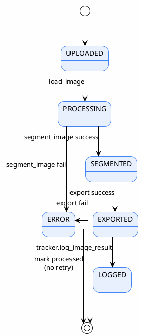

# 03 — Pipeline Flow

> ลำดับการทำงานทีละ step — ข้อมูลเดินผ่านอะไรบ้าง
>
> **Status**: Verified — สอบกับ `src/batch_segment.py:main()` บรรทัด 130-435

---

## Flowchart หลัก

---

## ขั้นตอนที่ระบบทั่วไปมักมี (แต่โค้ดนี้ไม่มี)

| ขั้นตอนทั่วไป | สถานะ | หมายเหตุ |
|---------------|-------|---------|
| Validate image (corrupted check) | ⚠️ มีบางส่วน | `load_image()` catch exception → return `None` แต่ไม่มี validation เชิงรุก |
| Filter small objects (min area) | ❌ ไม่มี | ไม่มี `min_area` filter — มีแค่ drop tiny components <3px ตอน trace polygon |
| Classify region | ❌ ไม่มี | SAM 3.1 ให้ class มาจาก text prompt โดยตรง |
| Calculate confidence (composite score) | ❌ ไม่มี | ใช้ score ดิบจาก model ไม่มี weighted formula |
| Human review branch | ❌ ไม่มี | ทุก detection ที่ผ่าน threshold → annotation ทันที |
| Retry on failure | ❌ ไม่มี | mark processed และข้าม |

---

## อ้างอิง

- `src/batch_segment.py:130-435` — `main()` ทั้งฟังก์ชัน
- `src/inference.py:382-520` — `segment_image()`
- `src/exporters.py:608-623` — `write_image_exports()`, `finalize_exports()`
