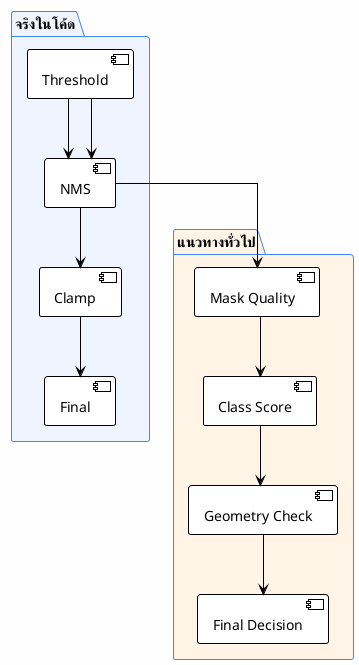
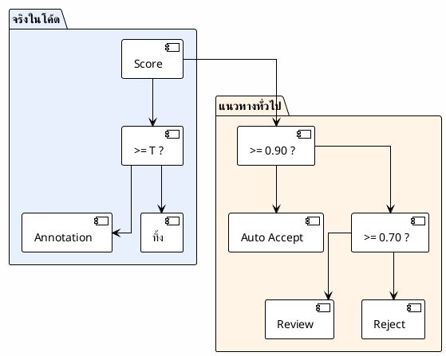

# 09 — Quality Control

> ระบบรู้ได้ยังไงว่า auto-label ที่สร้างขึ้นมันถูก?
>
> **Status**: Verified — สอบกับ `src/inference.py`, `src/exporters.py`

---

## QC ที่มีจริงในโค้ด



> ระบบจริงมี QC น้อยกว่าแนวทางทั่วไปมาก — พึ่ง threshold + NMS เป็นหลัก

---

## ความเสี่ยงด้านคุณภาพ

| ความเสี่ยง | ระดับ | กลไกที่ช่วย | สิ่งที่ขาด |
|-----------|-------|-------------|-----------|
| Mask ใหญ่เกินไป (ครอบทั้งภาพ) | สูง | — | ไม่มี `max_area_ratio` filter |
| Mask เล็กเกินไป (1-2 px) | กลาง | tiny component drop (< 3px) | ไม่มี `min_area` filter ที่ configurable |
| Polygon ผิดรูป | กลาง | Douglas-Peucker | ไม่มี self-intersection check |
| False positive จาก threshold ต่ำ | สูง | — | ไม่มี review tier |
| Overlap ระหว่างคลาสคล้ายกัน | กลาง | NMS $\text{IoU}=0.5$ | ถ้า $\text{IoU} < 0.5$ จะเก็บทั้งคู่ |

---

## อ้างอิง

- `src/inference.py:416-425` — threshold
- `src/inference.py:189-313` — NMS
- `src/inference.py:140-145` — clamp_box
- `src/exporters.py:87-116` — Douglas-Peucker
- `src/exporters.py:147-149` — tiny component drop

---


# 10 — Confidence Scoring

> ระบบคำนวณ confidence score ยังไง และใช้ตัดสินใจอะไร
>
> **Status**: Verified — สอบกับ `src/inference.py:382-520`

---

## Confidence Score จริงในโค้ด

### ที่มา

Score มาจาก **SAM 3.1 โดยตรง** — เป็น output ของโมเดล ไม่ได้คำนวณเพิ่ม

```python
# src/inference.py (สรุปจาก segment_image)
output = processor.set_text_prompt(state=inference_state, prompt=cat.prompt)
masks, boxes, scores = output.masks, output.boxes, output.scores
# scores เป็น float tensor [N] ค่า 0.0–1.0
```

### การใช้งาน



---

## ค่า Threshold ที่ใช้จริง

| Category | Threshold | ระดับ | หมายเหตุ |
|----------|-----------|-------|---------|
| `person` | $0.7$ | สูง | object ใหญ่ ชัดเจน → ตั้งสูงเพื่อลด false positive |
| `helmet` | $0.25$ | ต่ำ | object เล็ก → ตั้งต่ำเพื่อไม่ให้หาย |
| `boots` | $0.25$ | ต่ำ | เดียวกัน |
| `shoes` | $0.25$ | ต่ำ | เดียวกัน |
| `sandals` | $0.3$ | กลาง | ค่อนข้างหายาก |
| `harness` | $0.25$ | ต่ำ | หายาก + ลักษณะซับซ้อน |
| Global | $0.25$ | ต่ำ | fallback |

> **สังเกต**: threshold ส่วนใหญ่อยู่ที่ $0.25$ — ค่อนข้างต่ำ → อาจปล่อย false positive ผ่านเข้า dataset

---

## อ้างอิง

- `src/inference.py:404-406` — inference call
- `src/inference.py:416` — threshold logic
- `src/inference.py:421` — filter
- `src/inference.py:512` — score ใน annotation
- `config/ppe_6class.yaml` — threshold values
