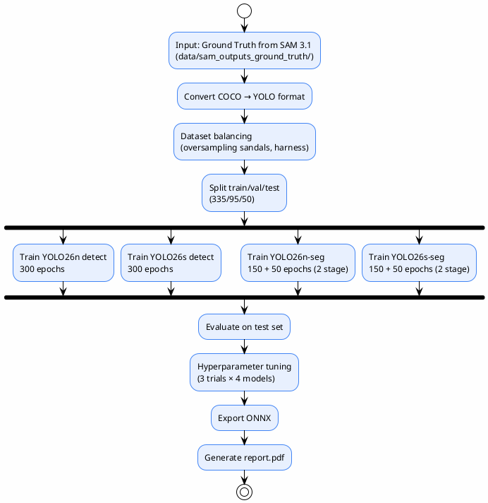
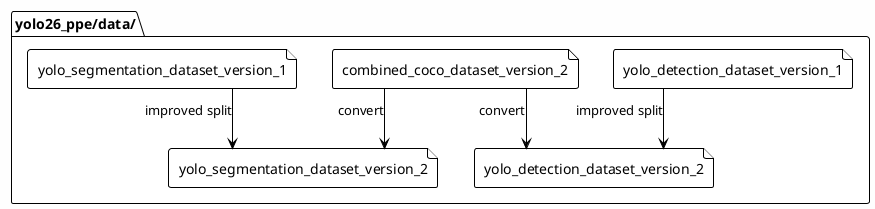

# YOLO26 Training (Requirement 2)

> เทรน YOLO26 จำนวน 4 รุ่น เพื่อเปรียบเทียบ accuracy–efficiency trade-off สำหรับ PPE detection
>
> **Status**: Verified — สอบกับ `yolo26_ppe/`, `yolo26_ppe/reports/final/report.pdf`, `yolo26_ppe/configs/`

---

## Objective

เปรียบเทียบประสิทธิภาพและ computational efficiency ของ YOLO26 จำนวน 4 รุ่น:

| Model | Task | Scale |
|-------|------|-------|
| YOLO26n | Detection | Nano |
| YOLO26s | Detection | Small |
| YOLO26n-seg | Segmentation | Nano |
| YOLO26s-seg | Segmentation | Small |

> ที่มา: `yolo26_ppe/reports/source/report.tex:634-650`

---

## Training Pipeline

---

## Training Configuration

| Parameter | Value |
|-----------|-------|
| Epochs | 300 (detect), 150+50 (seg — 2 stage) |
| Batch size | 8 (detect), 4 (seg) |
| Image size | 640 px |
| Optimizer | SGD |
| Learning rate (lr0) | 0.01 |
| Final LR factor (lrf) | 0.01 (cosine decay) |
| Momentum | 0.937 |
| Weight decay | 0.0005 |
| Warmup epochs | 3 |
| Patience | 50 |
| Freeze | 10 (backbone frozen) |
| Hardware | AMD RX 7800 XT (ROCm, WSL2) |
| Random seed | 42 |

> ที่มา: `yolo26_ppe/reports/source/report.tex:652-677`, `yolo26_ppe/configs/production_train.yaml`

---

## Dataset

### ขนาด

| Split | จำนวนภาพ |
|-------|---------|
| Train | 335 |
| Validation | 95 |
| Test | 50 |
| **รวม** | **480** |

> ที่มา: `yolo26_ppe/reports/metrics/comparison_report.md:3`

### Class Distribution

| Class | Original Count | สถานะ |
|-------|---------------|-------|
| person | 2271 | Adequate |
| helmet | 2693 | Adequate |
| boots | 802 | Adequate |
| shoes | 2407 | Adequate |
| sandals | 4 | Severely underrepresented |
| harness | 102 | Underrepresented |

### Class Balancing

- **Imbalance ratio (before)**: 2693:4 = 673:1
- **Imbalance ratio (after)**: 3003:56 = 53.6:1
- **Oversampling**: sandals +30, harness +114

> ที่มา: `yolo26_ppe/reports/metrics/comparison_report.md:64-66`

---

## Dataset Versions

> ที่มา: `yolo26_ppe/data/` directory listing

---

## MLflow Integration

YOLO26 training ใช้ **MLflow** สำหรับ experiment tracking (ต่างจาก SAM 3.1 ที่ใช้ SQLite):

@import "../../yolo26_ppe/configs/mlflow.yaml" {title="mlflow.yaml"}

> MLflow tracking URI และ configuration อยู่ใน `yolo26_ppe/configs/mlflow.yaml`

---

## Training Config

@import "../../yolo26_ppe/configs/production_train.yaml" {title="production_train.yaml"}

---

## Augmentation Config

@import "../../yolo26_ppe/configs/production_augmentation.yaml" {title="production_augmentation.yaml"}

---

## Hyperparameter Tuning

| Model | Baseline mAP50 | Best Trial mAP50 | Improved? |
|-------|---------------|-----------------|-----------|
| n_detect | 0.4623 | 0.3950 | ❌ No |
| s_detect | 0.5551 | 0.4937 | ❌ No |
| n_seg | 0.4158 | 0.3822 | ❌ No |
| s_seg | 0.5538 | 0.4753 | ❌ No |

> **สรุป**: 50-epoch tuning trials ไม่สามารถเทียบ 150-epoch baseline ได้ — baseline weights ถูกเก็บไว้ทั้งหมด
>
> ที่มา: `yolo26_ppe/reports/metrics/comparison_report.md:119-174`

### Parameters ที่ tune

- `lr0`, `imgsz`, `cls_pw`, `mosaic`, `mixup`, `copy_paste`, `scale`, `close_mosaic`

---

## อ้างอิง

- `yolo26_ppe/reports/final/report.pdf` — รายงานฉบับสมบูรณ์
- `yolo26_ppe/reports/source/report.tex:628-747` — RQ2 chapter
- `yolo26_ppe/reports/inputs/final_eval_results.json` — metrics
- `yolo26_ppe/reports/metrics/comparison_report.md` — comparison summary
- `yolo26_ppe/configs/production_train.yaml` — training config
- `yolo26_ppe/configs/production_augmentation.yaml` — augmentation config
- `yolo26_ppe/configs/mlflow.yaml` — MLflow config
