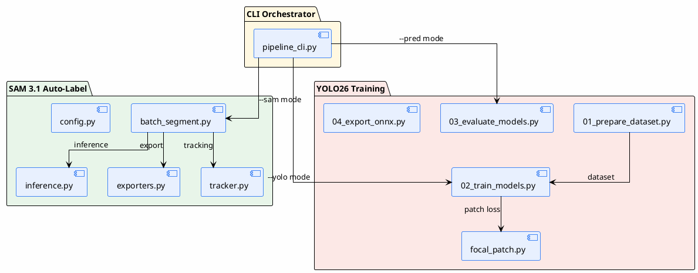

# SDLC Phase 1-2: Business Analysis and Requirements

| Field | Value |
| --- | --- |
| SDLC Phase | 1 (Business Analysis) + 2 (Requirements Analysis) |
| Status | Accepted |
| Owner | Engineering Team |
| Reviewers | Project Sponsor, Tech Lead |
| Audience | Stakeholders, Developers, QA |
| Last Updated | 2026-09-10 |
| Supersedes | none |

---

## Phase 1: Business Analysis

### 1.1 Executive Summary

Manual labeling of PPE (Personal Protective Equipment) images is slow and costly. Drawing bounding boxes and segmentation masks one image at a time is infeasible for datasets of tens of thousands of images. This project automates annotation using SAM 3.1 and trains YOLO26 models for production deployment, comparing four variants for the accuracy-speed trade-off.

### 1.2 Business Objectives and Goals

| ID | Objective | Measurement |
| --- | --- | --- |
| BO-01 | Automate PPE annotation with SAM 3.1 text-prompt segmentation | Throughput >= 0.3 FPS on GPU |
| BO-02 | Train YOLO26 in 4 variants for production | mAP50 >= 0.70 (achieved 0.808) |
| BO-03 | Generate ground truth from SAM output | 913 images, 5 classes, 11 export formats |
| BO-04 | Compare models for edge vs. server deployment | Inference <= 35 ms, size <= 50 MB |

### 1.3 Stakeholders

| Name | Role | Interest |
| --- | --- | --- |
| Project Sponsor | Funding | ROI, timeline |
| Engineering Team | Development | Technical feasibility |
| QA Lead | Quality | Test coverage, defect rate |
| DevOps | Deployment | CI/CD, runbook |
| End Users | Operators | Ease of use, accuracy |

### 1.4 Current State vs. Desired State

Current State:
- Manual annotation of PPE images by human labelers
- No automated pipeline for batch segmentation
- No trained detection/segmentation models for PPE
- No ground truth dataset for training

Desired State:
- SAM 3.1 auto-labels raw images with text prompts
- YOLO26 models trained and benchmarked
- Ground truth exported in 11 formats
- Production-ready pipeline with CLI and resume support

### 1.5 Scope

In Scope:
- SAM 3.1 batch segmentation with 6 PPE classes
- YOLO26 training (4 variants: n/s detect + n/s seg)
- Ground truth generation and dataset versioning
- ONNX export and inference benchmarking
- Comparison report (PDF)

Out of Scope:
- REST API (mentioned in RELEASE_NOTES but not implemented)
- Automated human review queue (verification is manual)
- Multi-model ensemble (compared in report only)
- GPU OOM recovery (not implemented)

### 1.6 Success Criteria and KPIs

| KPI | Target | Achieved | Measurement Method |
| --- | --- | --- | --- |
| Best model mAP50 | >= 0.70 | 0.808 (YOLO26s detect) | `final_eval_results.json` |
| Inference latency | <= 35 ms | 30.8-33.8 ms | ONNX benchmark |
| Model size | <= 50 MB | 10-42 MB | File system |
| SAM throughput | >= 0.3 FPS | ~0.36 FPS | Batch timing log |
| Export formats | >= 8 | 11 | `exporters.py` registry |

### 1.7 Risk Register

| ID | Risk | Category | Probability | Impact | Score | Mitigation | Owner | Status |
| --- | --- | --- | --- | --- | --- | --- | --- | --- |
| R-01 | Class imbalance (sandals: 4 images) | Data | High | High | 8 | Oversampling + Focal Loss | Engineering | Mitigated |
| R-02 | Python 3.13 incompatibility | Technical | Medium | High | 6 | setup.sh version detection | Engineering | Mitigated |
| R-03 | Checkpoint download failure (1-2 GB) | Operations | Medium | Medium | 4 | Manual download fallback | DevOps | Mitigated |
| R-04 | No automated tests | Quality | High | High | 8 | pytest suite (60 tests, 12 TCs) | QA | Resolved |
| R-05 | Hardcoded WSL paths reduce portability | Technical | Medium | Medium | 4 | Fixed: portable path resolution | Engineering | Resolved |

---

## Phase 2: Requirements Analysis

### 2.1 Product Perspective

The system consists of three modules orchestrated by `pipeline_cli.py`:

### 2.2 Functional Requirements

#### RQ1: SAM 3.1 Auto-Labeling

| ID | Requirement | Priority | Status |
| --- | --- | --- | --- |
| FR-01 | Run batch segmentation on image folder | Must | Done |
| FR-02 | Support multi-class text prompts (6 classes) | Must | Done |
| FR-03 | Generate bounding box + segmentation mask | Must | Done |
| FR-04 | Export to 11 formats (COCO, YOLO, VOC, ...) | Must | Done |
| FR-05 | Checkpoint and resume | Must | Done |
| FR-06 | Experiment tracking (SQLite) | Should | Done |
| FR-07 | Visualization overlay | Should | Done |
| FR-08 | GPU auto-detect (CUDA, ROCm, MPS, CPU) | Must | Done |

#### RQ2: YOLO26 Training

| ID | Requirement | Priority | Status |
| --- | --- | --- | --- |
| FR-10 | Train 4 YOLO26 variants (n/s detect + n/s seg) | Must | Done |
| FR-11 | Dataset preparation from ground truth | Must | Done |
| FR-12 | MLflow experiment tracking | Should | Done |
| FR-13 | Hyperparameter tuning (3 trials x 4 models) | Could | Done |
| FR-14 | ONNX export | Must | Done |
| FR-15 | Comparison report (PDF) | Must | Done |
| FR-16 | Class balancing (oversampling + Focal Loss) | Must | Done |

#### RQ3: Ground Truth Generation

| ID | Requirement | Priority | Status |
| --- | --- | --- | --- |
| FR-20 | Generate ground truth from SAM 3.1 output | Must | Done |
| FR-21 | Human verification (manual) | Should | Done |
| FR-22 | Dataset versioning (v1, v2) | Must | Done |
| FR-23 | Train/val/test split (80/10/10) | Must | Done |

#### Not Implemented

| ID | Requirement | Status |
| --- | --- | --- |
| FR-30 | REST API | Not in code |
| FR-31 | Automated human review queue | Manual only |
| FR-32 | Multi-model agreement (ensemble) | Report comparison only |
| FR-33 | mAP50 >= 0.85 target | Max 0.808 (dataset limited) |

### 2.3 Non-Functional Requirements

| ID | Category | Requirement | Target | Achieved |
| --- | --- | --- | --- | --- |
| NFR-01 | Performance | SAM throughput on GPU | >= 0.3 FPS | ~0.36 FPS |
| NFR-02 | Portability | Runs on CPU (slow) | Supported | Yes |
| NFR-03 | Reliability | No data loss on power failure | Checkpoint | Yes |
| NFR-04 | Reproducibility | Config hash for reproducible runs | SHA256 | Yes (md5 -> sha256 pending) |
| NFR-05 | Training reproducibility | Seed=42 | Fixed seed | Yes |
| NFR-06 | Inference latency | All models <= 35 ms | 30.8-33.8 ms | Yes |
| NFR-07 | Model size | All models <= 50 MB | 10-42 MB | Yes |
| NFR-08 | Security | No secrets in code | Verified | Yes |
| NFR-09 | Security | Path traversal prevention | Sanitized | Yes (fixed) |
| NFR-10 | Security | No shell=True injection | Eliminated | Yes (fixed) |
| NFR-11 | Security | MLflow localhost-only | 127.0.0.1 | Yes (fixed) |

### 2.4 Interface Requirements

| Interface | Type | Description |
| --- | --- | --- |
| `auto_label.sh` | CLI entry point | Shell wrapper, launches `pipeline_cli.py` |
| `setup.sh` | Setup script | Detects Python, creates venv, installs deps, downloads checkpoint |
| `pipeline_cli.py` | Interactive CLI | 3 modes: sam, yolo, pred |
| `ppe_6class.yaml` | Config | 6 PPE classes, per-class thresholds |
| `production_train.yaml` | Config | YOLO26 training recipe |
| `mlflow.yaml` | Config | MLflow tracking server |

### 2.5 Data Requirements

| Data | Source | Size | Format |
| --- | --- | --- | --- |
| Raw images | `data/raw/` | Variable | jpg, png, bmp, webp, tiff |
| SAM checkpoint | HuggingFace | ~3.34 GB | PyTorch .pt |
| Ground truth | `data/sam_outputs_ground_truth/` | 913 images | COCO JSON + 10 formats |
| YOLO dataset | `yolo26_ppe/data/` | 913 split 80/10/10 | YOLO txt + data.yaml |
| Trained models | `yolo26_ppe/models/production/` | 4 models | .pt + .onnx |

### 2.6 Traceability Matrix

| Requirement ID | Source | Test Case ID | Status |
| --- | --- | --- | --- |
| FR-01 | BRD BO-01 | TC-01 | Implemented (integration, skipped on Windows) |
| FR-02 | BRD BO-01 | TC-02 | Implemented |
| FR-03 | BRD BO-01 | TC-03 | Implemented |
| FR-04 | BRD BO-03 | TC-04 | Implemented |
| FR-05 | NFR-03 | TC-05 | Implemented |
| FR-10 | BRD BO-02 | TC-10 | Implemented |
| FR-14 | BRD BO-04 | TC-14 | Implemented |
| FR-16 | Risk R-01 | TC-16 | Implemented |
| NFR-08 | ISO 27001 | TC-30 | Verified |
| NFR-09 | ISO 27001 | TC-31 | Verified |
| NFR-10 | ISO 27001 | TC-32 | Verified |

> Note: All 12 test cases (TC-01 through TC-12) are implemented in `tests/` as pytest suites.
> Run `python -m pytest tests/` to execute. See Phase 5 for details.

---

## References

- `docs/00-overview.md` - Project overview and 3 requirements
- `docs/01-requirements.md` - Hardware/software requirements
- `yolo26_ppe/reports/final/report.pdf` - Full ML/DL report
- `sam3_auto_label/config/ppe_6class.yaml` - 6-class config
- `yolo26_ppe/configs/production_train.yaml` - Training config
