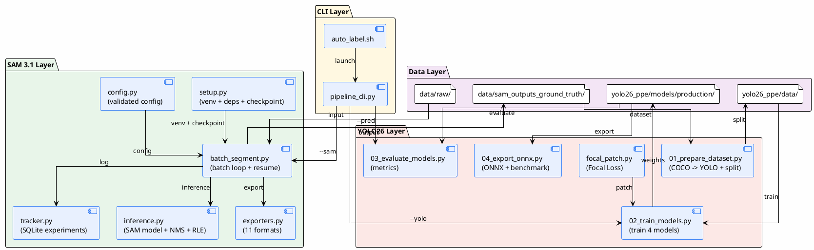
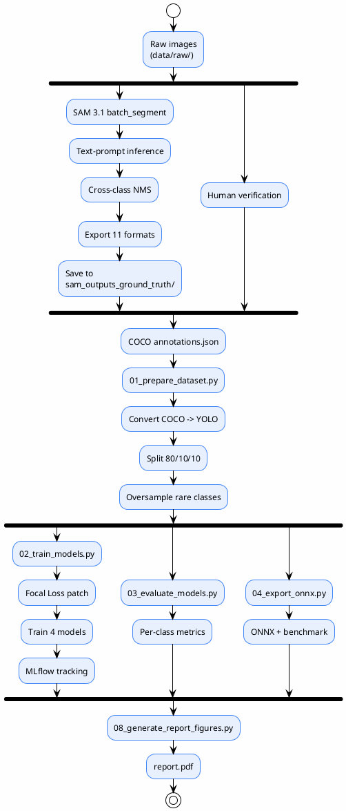
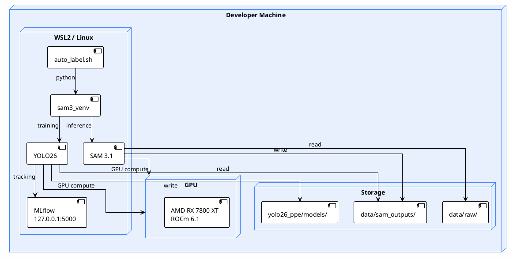

# SDLC Phase 3-4: Architecture, Design, and Development

| Field | Value |
| --- | --- |
| SDLC Phase | 3 (Architecture and Design) + 4 (Development) |
| Status | Accepted |
| Owner | Systems Architect |
| Reviewers | Tech Lead, Engineering Team |
| Audience | Developers, QA, DevOps |
| Last Updated | 2026-09-10 |
| Supersedes | none |

---

## Phase 3: Architecture and Design

### 3.1 System Architecture

The system has three layers: CLI orchestration, SAM 3.1 auto-labeling, and YOLO26 training. Each layer is independent and communicates through the filesystem (images, annotations, model weights).



### 3.2 Component Design

#### 3.2.1 SAM 3.1 Auto-Labeling (`sam3_auto_label/`)

| Component | File | Responsibility |
| --- | --- | --- |
| Config | `src/config.py` | Typed dataclass config with validation, YAML loading |
| Inference | `src/inference.py` | SAM 3.1 model build, text-prompt inference, cross-class NMS, RLE encoding |
| Batch Segment | `src/batch_segment.py` | Batch loop with checkpoint/resume, ETA, ThreadPoolExecutor for I/O |
| Exporters | `src/exporters.py` | Registry pattern for 11 output formats with `needs` validation |
| Tracker | `src/tracker.py` | SQLite experiment tracking with config hash |
| Setup | `setup.py` | Python detection, venv creation, PyTorch install, checkpoint download |

Design decisions:
- Config uses dataclasses with `__post_init__` validation (no schema library needed)
- Exporters use a registry dict keyed by format name, each with a `needs` set
- Batch loop uses `ThreadPoolExecutor` to prefetch images while GPU processes
- Checkpoint is a JSON file with per-image status, enabling resume after crash
- NMS is cross-class (suppresses overlapping detections across all PPE classes)

#### 3.2.2 YOLO26 Training (`yolo26_ppe/`)

| Component | File | Responsibility |
| --- | --- | --- |
| Dataset Prep | `scripts/pipeline/01_prepare_dataset.py` | COCO to YOLO conversion, train/val/test split, oversampling |
| Training | `scripts/pipeline/02_train_models.py` | Train 4 models (2-stage for seg), MLflow logging |
| Focal Loss | `focal_patch.py` | Monkey-patch `v8DetectionLoss.bce` with FocalBCE |
| Evaluation | `scripts/pipeline/03_evaluate_models.py` | Per-class metrics, confusion matrix |
| ONNX Export | `scripts/pipeline/04_export_onnx.py` | ONNX export + inference benchmark |
| Report | `scripts/pipeline/08_generate_report_figures.py` | Generate PDF figures from metrics |

Design decisions:
- Focal Loss is a monkey-patch (not a custom trainer) to keep Ultralytics upgrade path open
- Oversampling duplicates whole images for rare classes (harness, boots)
- 2-stage training for segmentation: Stage 1 (150 epochs) + Stage 2 fine-tune (50 epochs)
- MLflow is optional (graceful degradation if import fails)

#### 3.2.3 CLI Orchestrator (`pipeline_cli.py`)

| Function | Responsibility |
| --- | --- |
| `discover_datasets()` | Scan `data/raw/` for image folders |
| `parse_model_list()` | Parse comma-separated model names |
| `resolve_input_dir()` | Resolve and sanitize input path |
| `resolve_output_dir()` | Resolve and sanitize output path |
| `_sanitize_path()` | Prevent path traversal (resolve + base-dir containment) |
| `check_sam_checkpoint()` | Verify checkpoint exists |
| `run_sam_batch()` | Launch SAM batch segmentation |
| `run_yolo_train()` | Launch YOLO26 training |
| `run_yolo_predict()` | Launch YOLO26 inference |
| `interactive_mode()` | Interactive menu with questionary + rich |

### 3.3 Data Flow



### 3.4 Architecture Decision Records

#### ADR-001: SAM 3.1 for Auto-Labeling (Accepted)

| Field | Value |
| --- | --- |
| Status | Accepted |
| Date | 2025-01-15 |
| Deciders | Engineering Team |

Context: Need to auto-label PPE images without manual annotation. Options: SAM 3.1, Grounding DINO, manual labeling.

Decision: Use SAM 3.1 with text prompts for zero-shot segmentation.

Alternatives:
- Grounding DINO: Rejected because no segmentation mask output
- Manual labeling: Rejected because infeasible for 10k+ images

Consequences:
- Positive: Zero-shot, no training needed, 6 classes via text prompt
- Negative: 3.34 GB checkpoint, ~700 ms/image (slow for real-time)

#### ADR-002: Focal Loss as Monkey-Patch (Accepted)

| Field | Value |
| --- | --- |
| Status | Accepted |
| Date | 2025-06-20 |
| Deciders | Engineering Team |

Context: PPE dataset has class imbalance up to 10.5:1 (helmet vs. harness). Standard BCE underperforms on rare classes.

Decision: Monkey-patch `v8DetectionLoss.bce` with FocalBCE (gamma=1.5, alpha=0.25) instead of a custom trainer.

Alternatives:
- Custom trainer subclass: Rejected because more code to maintain, breaks on Ultralytics updates
- Class weights only: Rejected because insufficient for extreme imbalance

Consequences:
- Positive: Minimal code, keeps Ultralytics upgrade path open
- Negative: Patch may break on Ultralytics API changes; mask loss not patched
- Mitigation: `FOCAL_PATCH_APPLIED` flag checked at runtime; warning if patch fails

#### ADR-003: Portable venv Path (Accepted)

| Field | Value |
| --- | --- |
| Status | Accepted |
| Date | 2026-09-10 |
| Deciders | Engineering Team |

Context: `pipeline_cli.py` hardcoded `/opt/sam3_venv/bin/python` and `/mnt/e/02_Projects/auto_label`, breaking on fresh machines.

Decision: Use `Path(__file__).resolve().parent` for repo root and `sam3_auto_label/sam3_venv/` for the venv. Allow `YOLO_PYTHON` env override.

Alternatives:
- Keep hardcoded paths: Rejected because not portable
- Global venv at `/opt`: Rejected because requires root, not per-project

Consequences:
- Positive: Works on any machine after `setup.sh`
- Negative: None identified

### 3.5 Deployment Architecture



---

## Phase 4: Development

### 4.1 Development Standards

| Standard | Tool | Enforcement |
| --- | --- | --- |
| Python style | PEP 8 | Manual (no linter configured) |
| Shell style | bash -n | Manual |
| Import order | stdlib, third-party, local | Convention |
| Config | YAML with safe_load | All configs |
| Error handling | Specific exceptions (not bare except) | Enforced after audit |
| Path handling | Path() objects, not string concat | Convention |
| Encoding | UTF-8 explicit on open() | Enforced after audit |

### 4.2 Code Organization

```text
auto_label/
  auto_label.sh              # Entry point (shell wrapper)
  setup.sh                   # Setup script (Python detection + venv)
  pipeline_cli.py            # CLI orchestrator (3 modes)
  sam3_auto_label/
    setup.py                 # venv creation, deps, checkpoint
    requirements.txt         # SAM dependencies
    sam3_venv/               # Created by setup.py (gitignored)
    checkpoints/             # SAM checkpoint (gitignored)
    src/
      config.py              # Typed config dataclasses
      inference.py           # SAM 3.1 inference + NMS
      batch_segment.py       # Batch loop + resume
      exporters.py           # 11 export formats
      tracker.py             # SQLite experiment tracking
    config/
      ppe_6class.yaml         # 6 PPE classes + thresholds
  yolo26_ppe/
    focal_patch.py            # Focal Loss monkey-patch
    configs/
      production_train.yaml   # Training recipe
      production_augmentation.yaml
      mlflow.yaml             # MLflow config (127.0.0.1)
    scripts/
      pipeline/
        01_prepare_dataset.py
        02_train_models.py
        03_evaluate_models.py
        04_export_onnx.py
        05_generate_failure_montage.py
        06_run_blur_robustness.py
        07_analyze_blur_robustness.py
        08_generate_report_figures.py
        09_predict_raw_images.py
      services/
        manage_mlflow_background.sh
        run_mlflow_foreground.sh
    models/production/        # Trained weights (gitignored)
    reports/
      source/report.tex       # LaTeX source
      final/report.pdf        # Compiled report
```

### 4.2.1 Test Infrastructure

The project includes a pytest test suite (76 tests across 8 files) covering 17 SDLC test cases:

```text
tests/
  conftest.py                          # Shared fixtures (repo_root, module loaders)
  pytest.ini                           # Markers: unit, integration, static
  unit/
    test_path_safety.py                # TC-03: path traversal (12 tests)
    test_focal_patch.py                # TC-04: focal patch verification (7 tests)
    test_dataset_prep.py               # TC-05, TC-06: split + oversampling (16 tests)
    test_config_static.py              # TC-09, TC-12: MLflow + checkpoint path (7 tests)
    test_security_static.py            # TC-10, TC-11: secrets + shell=True scan (4 tests)
    test_provenance.py                 # TC-13 to TC-17: provenance, retry, validator, min_area, sha256 (16 tests)
  integration/
    test_sam_batch.py                  # TC-01, TC-02: SAM batch + resume (4 tests)
    test_yolo_training.py              # TC-07, TC-08: YOLO training + ONNX (10 tests)
```

Test markers:

- `@pytest.mark.unit` — pure-function tests (no GPU, no network)
- `@pytest.mark.integration` — end-to-end tests requiring checkpoint/GPU
- `@pytest.mark.static` — static-analysis / config-file scans

Run: `python -m pytest tests/` → 75 passed, 1 skipped (TC-01 needs WSL `sam3` module)

### 4.3 Security Controls Implemented

| Control | ISO 27001 | Implementation | Status |
| --- | --- | --- | --- |
| No secrets in code | A.14.2.1 | Verified: no passwords, keys, tokens | Pass (TC-10 automated) |
| Input validation | A.14.1.2 | `_sanitize_path()` prevents traversal | Pass (TC-03 automated) |
| No command injection | A.14.2.5 | `shell=True` eliminated, uses `shutil` | Pass (TC-11 automated) |
| Network binding | A.13.1.1 | MLflow bound to 127.0.0.1 | Pass (TC-09 automated) |
| Checkpoint integrity | A.12.5.1 | SHA256 verification framework | Partial |
| Interpreter validation | A.9.4.1 | Repo-local venv, env override | Pass (TC-12 automated) |

### 4.4 Known Technical Debt

| ID | Debt | Severity | Effort |
| --- | --- | --- | --- |
| TD-01 | No automated tests (0% coverage) | Critical | Resolved |
| TD-02 | `pipeline_cli.py` is 1,630 lines (monolith) | Major | Medium |
| TD-03 | YOLO recipe duplicated in 2 files | Major | Low |
| TD-04 | `inference.py` passes None to NMS when no boxes | Major | Low |
| TD-05 | O(n^2) oversampling naming in `01_prepare_dataset.py` | Major | Low |
| TD-06 | Broad `except Exception:` in multiple files | Major | Medium |
| TD-07 | `open()` missing `encoding="utf-8"` | Minor | Low |
| TD-08 | Broken doc links in README | Minor | Low |
| TD-09 | Focal patch does not cover mask loss | Minor | Medium |
| TD-10 | `tracker.py` uses md5 instead of sha256 | Minor | Resolved (TC-17) |

---

## References

- `docs/architecture/01-system-architecture.md` - Full architecture
- `docs/architecture/02-data-flow.md` - Data flow diagrams
- `docs/architecture/03-deployment.md` - Deployment details
- `docs/design/01-component-design.md` - Component responsibilities
- `docs/design/02-class-diagram.md` - Class diagram
- `docs/design/03-sequence-diagram.md` - Sequence diagrams
